# 日常流水帳系統 (Daily Ledger System) — 工作區 Harness 工程架構與專案功能說明報告

> **文件版本**：v1.0.0 (正式報告版)  
> **產出日期**：2026-09-04  
> **系統名稱**：日常流水帳系統 (Daily Ledger System)  
> **核心技術棧**：Java 21 (Temurin) ｜ Spring Boot 3.3.13 ｜ Spring Data JPA ｜ MS SQL Server 2022 & H2 In-Memory ｜ Microsoft Playwright for Java 1.46.0 ｜ Vue 3 MVVM ｜ Bootstrap 5.3.3 (Strict No-CDN 瑞士風格) ｜ OpenSpec 規格治理  
> **文件定位**：全域工程架構線束 (Harness Engineering) 深度解析與業務功能完整說明報告  

---

## 報告目錄導覽 (Table of Contents)

1. [執行摘要 (Executive Summary)](#1-執行摘要-executive-summary)
2. [專案功能全景與業務領域模型 (Project Features & Business Domains)](#2-專案功能全景與業務領域模型-project-features--business-domains)
   - [2.1 身分認證與帳號安全領域 (Authentication & Security)](#21-身分認證與帳號安全領域-authentication--security)
   - [2.2 雙層樹狀收支分類管理領域 (Category Management)](#22-雙層樹狀收支分類管理領域-category-management)
   - [2.3 日常流水帳核心記帳領域 (Daily Ledger CRUD & Search)](#23-日常流水帳核心記帳領域-daily-ledger-crud--search)
   - [2.4 智慧自然語言快速記帳解析領域 (Smart NLP Parsing)](#24-智慧自然語言快速記帳解析領域-smart-nlp-parsing)
   - [2.5 多維度財務彙總統計領域 (Financial Analytics & Aggregation)](#25-多維度財務彙總統計領域-financial-analytics--aggregation)
   - [2.6 純離線瑞士風格前端介面 (Swiss Style Offline Frontend)](#26-純離線瑞士風格前端介面-swiss-style-offline-frontend)
3. [系統分層技術架構與安全防護鏈 (System Architecture & Security Pipeline)](#3-系統分層技術架構與安全防護鏈-system-architecture--security-pipeline)
   - [3.1 後端四層分層架構](#31-後端四層分層架構)
   - [3.2 輕量自訂安全過濾鏈與例外轉譯真實鏈路](#32-輕量自訂安全過濾鏈與例外轉譯真實鏈路)
4. [工作區 Harness 工程架構體系深度解析 (Harness Engineering Architecture)](#4-工作區-harness-工程架構體系深度解析-harness-engineering-architecture)
   - [4.1 什麼是工作區的「Harness 工程體系」？](#41-什麼是工作區的-harness-工程體系)
   - [4.2 三層測試金字塔線束 (Multi-Tier Test Harness)](#42-三層測試金字塔線束-multi-tier-test-harness)
   - [4.3 雙資料庫測試線束切換機制 (Dual-Database Test Harness)](#43-雙資料庫測試線束切換機制-dual-database-test-harness)
   - [4.4 集中式測試固件與使用者工廠 (Fixtures & User Factory)](#44-集中式測試固件與使用者工廠-fixtures--user-factory)
   - [4.5 Page Object Model (POM) 真機瀏覽器線束](#45-page-object-model-pom-真機瀏覽器線束)
5. [持續整合 (CI/CD) 與規格治理線束 (CI/CD & Governance Harness)](#5-持續整合-cicd-與規格治理線束-cicd--governance-harness)
   - [5.1 GitHub Actions 雙層品質守門管線](#51-github-actions-雙層品質守門管線)
   - [5.2 OpenSpec 規格驅動開發線束](#52-openspec-規格驅動開發線束)
   - [5.3 start.ps1 智慧本機維運與啟動線束](#53-startps1-智慧本機維運與啟動線束)
6. [資料庫模型與實體關聯圖 (Database Schema & ERD)](#6-資料庫模型與實體關聯圖-database-schema--erd)
7. [核心業務時序推演 (Sequence Diagrams)](#7-核心業務時序推演-sequence-diagrams)
   - [7.1 認證鑑權與多租戶存取時序](#71-認證鑑權與多租戶存取時序)
   - [7.2 結構化與 NLP 快速記帳時序](#72-結構化與-nlp-快速記帳時序)
8. [結論與架構亮點總結 (Conclusion & Architecture Highlights)](#8-結論與架構亮點總結-conclusion--architecture-highlights)

---

## 1. 執行摘要 (Executive Summary)

「**日常流水帳系統 (Daily Ledger System)**」是一套融合企業級後端工程標準、純離線現代化前端架構、嚴密自動化工程線束 (Harness Engineering) 以及瑞士國際主義極簡美學的個人與組織財務流水帳管理系統。

本報告旨在針對專案之**兩大核心軸心**進行系統化、透明化的技術盤點與架構總覽：
1. **專案功能說明 (Business & Features)**：從認證、分類、流水帳、NLP 智慧解析、統計彙總到瑞士風格 No-CDN 介面的全方位功能矩陣與業務規格。
2. **工作區 Harness 工程架構說明 (Harness Engineering)**：解構工作區如何透過**單元測試線束 (Surefire)**、**整合測試線束 (Failsafe + MockMvc + 雙資料庫切換)**、**端到端真機驗收線束 (Playwright POM + TestRestTemplate)**、**GitHub Actions 雙層 CI 門禁線束**、**安全憑證防禦線束**以及 **OpenSpec 規格治理線束**，構成一套零盲區、高防禦性且具備極速反饋能力的軟體工程驗證體系。

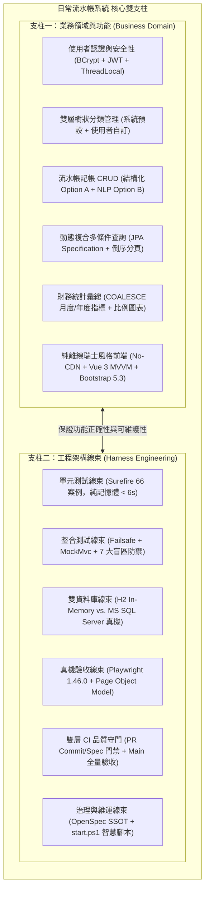

---

## 2. 專案功能全景與業務領域模型 (Project Features & Business Domains)

日常流水帳系統的業務核心圍繞於「精準記帳、階層分類、直覺查詢與即時視覺化彙總」。系統將業務切分為六大核心功能領域：

### 2.1 身分認證與帳號安全領域 (Authentication & Security)

系統提供無狀態、多租戶隔離的現代化安全防護機制：
* **使用者註冊 (`POST /api/v1/auth/register`)**：
  * 使用者名稱唯一性校驗 (`sys_user.username`)。
  * 密碼強度檢核：透過 [PasswordPolicyValidator](file:///c:/Arvin/GitHub/Tibame_Java2026/Tibame_Java2026/src/main/java/com/tibame/common/crypto/password/PasswordPolicyValidator.java) 進行長度與字元組合（英數字/特殊符號）強制校驗。
  * 密碼雜湊防護：採用標準 BCrypt 鹽值雜湊演算法存入資料庫，嚴禁明文留存。
* **登入與權限簽發 (`POST /api/v1/auth/login`)**：
  * 帳號密碼校驗成功後，簽發基於 HMAC-SHA256 的無狀態 JJWT Bearer Token。
  * Token 內含使用者識別碼 (`userId`) 與帳號 (`username`)，具備動態過期時間戳機制。
* **身分上下文裝載 (`GET /api/v1/auth/me`)**：
  * 依據請求 Header 之 Bearer Token，即時解析並返回目前登入者身分資訊，供前端進行身分狀態維持。
* **租戶存取強制隔離**：
  * 系統所有流水帳與自訂分類均嚴格綁定 `userId`，底層 SQL 自動附加租戶約束條件，杜絕越權存取漏洞。

### 2.2 雙層樹狀收支分類管理領域 (Category Management)

分類體系是流水記帳的核心骨幹，具備雙層樹狀結構與系統/自訂動態混合能力：
* **系統預設分類與使用者自訂分類並存**：
  * **系統預設 (`is_system = 1`)**：由系統資料庫種子資料預先載入（如餐飲聚餐、交通出行、日常用品、居住水電、薪資所得、投資理財等 11 種預設類別），`user_id` 為 NULL。
  * **個人自訂 (`is_system = 0`)**：使用者可依自身需求建立私有自訂分類，強制寫入當前 `user_id`。
* **動態查詢合併**：
  * 執行 `GET /api/v1/categories` 時，後端自動執行聯集：`(is_system = 1 AND user_id IS NULL) UNION (is_system = 0 AND user_id = :currentUserId)`，並按 `sort_order` 與 `id` 升冪排序。
* **嚴密刪除防呆保護**：
  * **系統內建保護**：禁止修改或刪除任何 `is_system = 1` 之類別。
  * **外鍵依賴保護 (409 Conflict)**：若欲刪除之自訂分類已被流水帳記錄（`account_record`）關聯引用，系統立即拒絕刪除並返回 HTTP 409 衝突錯誤，確保資料庫完整性。

### 2.3 日常流水帳核心記帳領域 (Daily Ledger CRUD & Search)

提供極速、直覺且高可靠的流水記帳與檢索：
* **結構化快速記帳 (Option A)**：
  * 支援收支類型切換 (`EXPENSE` 支出 / `INCOME` 收入)。
  * 金額精度檢核：限制大於零之正數，支援小數點後兩位 (`Decimal(12,2)`)。
  * 關聯指定分類、自訂日期（預設為今日）與備註摘要。
  * Enter 鍵極速提交，後端完成持久化並觸發前端即時更新。
* **流水記錄維護**：
  * 支援單筆記錄查詢 (`GET /api/v1/records/{id}`)、內容更新 (`PUT /api/v1/records/{id}`) 與實體刪除 (`DELETE /api/v1/records/{id}`)，更新與刪除皆具備租戶所有權校驗。
* **多維度動態複合搜尋與倒序分頁**：
  * 透過 Spring Data JPA `Specification` 實現動態 SQL 組合查詢：
    * 關鍵字模糊查詢（`keyword` 匹配描述備註）。
    * 分類過濾（`categoryId` 精確匹配）。
    * 收支類型過濾（`recordType` EXPENSE / INCOME）。
    * 日期區間篩選（`startDate` 至 `endDate` 範圍判定）。
  * 支援倒序分頁 (`recordDate DESC, id DESC`)，保障大數據量下的讀取效能。

### 2.4 智慧自然語言快速記帳解析領域 (Smart NLP Parsing)

為降低終端使用者的輸入摩擦，系統內建自然語言語意解析服務：
* **語句快速解析 (Option B 擴展)**：
  * 透過 [SmartParserService](file:///c:/Arvin/GitHub/Tibame_Java2026/Tibame_Java2026/src/main/java/com/tibame/service/SmartParserService.java)，使用者可於中央橫條直接輸入日常語句（如：「午餐 120」、「買手搖飲 65 飲料」、「薪資所得 55000」）。
* **模式比對與屬性提取**：
  * 利用正規表示式引擎自動抽取出數值金額、推定收支屬性，並依關鍵字權重模糊匹配至最佳分類，組裝為標準 `RecordCreateRequestDto` 自動落庫。

### 2.5 多維度財務彙總統計領域 (Financial Analytics & Aggregation)

* **即時財務看板指標 (`GET /api/v1/records/summary`)**：
  * 針對當月（或指定月度）自動聚合計算三大關鍵指標：
    1. **總支出 (Total Expense)**
    2. **總收入 (Total Income)**
    3. **淨結餘 (Net Balance = Total Income - Total Expense)**
  * 資料庫層使用 SQL `COALESCE(SUM(amount), 0)` 進行聚合計算，確保在無記錄時安全返回 0.00 而非 NULL。
* **可視化圖表分析**：
  * 按各分類計算支出比例，支援圓餅圖與趨勢柱狀圖呈現，讓使用者一眼看穿消費漏洞。

### 2.6 純離線瑞士風格前端介面 (Swiss Style Offline Frontend)

* **Strict No-CDN 離線封箱機制**：
  * 專案內建所有前端資源於 `src/main/resources/static/lib/`，嚴禁任何外網 CDN (cdnjs/unpkg/jsdelivr/google fonts) 引用，具備 100% 氣隙隔離 (Air-Gapped) 運行能力。
  * 本地庫包含：Bootstrap 5.3.3、Vue 3.4.x (Composition API)、Axios 1.7.x、SweetAlert2 11.x。
* **瑞士國際主義風格 (Swiss Design Style)**：
  * 設計哲學：形式服從功能、客觀、理性與秩序。
  * 視覺元素：白灰黑幾何底色、經典瑞士紅 (`#DC2626`) 重點標記、直角無圓角 (`border-radius: 0px`)、無模糊陰影、嚴謹非對稱網格佈局、工業風格編號標籤 (`SYS-LEDGER // 01`)。
* **雙視圖路由**：
  * `/login`：登入與註冊切換視圖。
  * `/ledger`：中央記帳台、統計指標面板、左側過濾條件與即時流水資料表格一體化工作台。

---

## 3. 系統分層技術架構與安全防護鏈 (System Architecture & Security Pipeline)

### 3.1 後端四層分層架構

系統嚴格遵循 Spring Boot 標準四層架構原則，層級之間單向依賴，禁止越權調用：

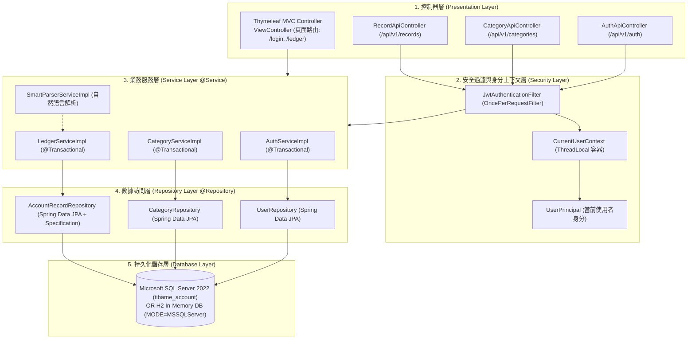

### 3.2 輕量自訂安全過濾鏈與例外轉譯真實鏈路

本專案摒棄重型 Spring Security FilterChain 設定，採用精巧透明的自訂安全性過濾與上下文管理機制。此機制確保了高吞吐量與極清晰的例外處理流向：

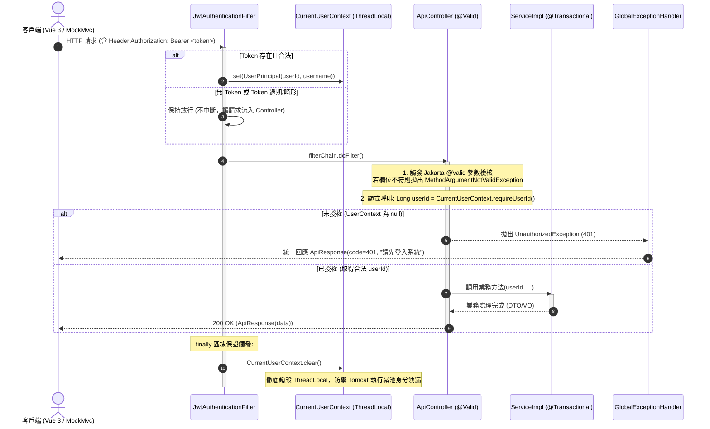

---

## 4. 工作區 Harness 工程架構體系深度解析 (Harness Engineering Architecture)

### 4.1 什麼是工作區的「Harness 工程體系」？

在現代軟體工程中，「**Harness（測試與工程線束）**」是指**包覆、驅動、監控並驗證整套系統行為的全面自動化工程基建**。它如同汽車出廠測試台上的線束傳感器，將被測目標（System Under Test, SUT）從外圍硬體、網路與環境依賴中解耦，提供**可重複執行、高保真度、無人工干預且能自我診斷的驗收迴路**。

在 `Tibame_Java2026` 工作區中，Harness 工程體系具體由五大維度緊密咬合構成：

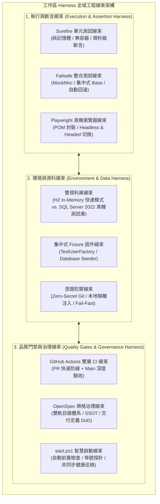

---

### 4.2 三層測試金字塔線束 (Multi-Tier Test Harness)

專案測試架構嚴格遵循測試金字塔原理，透過 Maven 插件分流機制（Surefire 與 Failsafe）將測試職責劃分為三層：

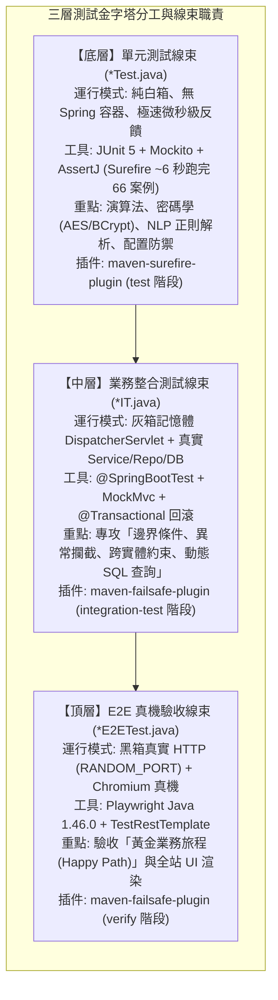

#### 各層線束實裝與盤點對照表

| 測試層級 | 執行插件 | 檔案命名規範 | 測試數量 | 啟動成本 | 守備核心與驗收重點 | 關鍵測試類別檔案連結 |
| :--- | :--- | :--- | :--- | :--- | :--- | :--- |
| **單元測試層 (Unit)** | `maven-surefire-plugin` | `*Test.java` | 66 案例 | ~6 秒 (無容器) | 密碼學加密、密碼強度政策、YAML 設定轉義防護、JWT 治理、NLP 解析、純業務運算 | [PasswordPolicyValidatorTest](file:///c:/Arvin/GitHub/Tibame_Java2026/Tibame_Java2026/src/test/java/com/tibame/common/crypto/password/PasswordPolicyValidatorTest.java) [CryptoServiceTest](file:///c:/Arvin/GitHub/Tibame_Java2026/Tibame_Java2026/src/test/java/com/tibame/common/crypto/cipher/CryptoServiceTest.java) [SmartParserServiceTest](file:///c:/Arvin/GitHub/Tibame_Java2026/Tibame_Java2026/src/test/java/com/tibame/SmartParserServiceTest.java) [CategoryServiceTest](file:///c:/Arvin/GitHub/Tibame_Java2026/Tibame_Java2026/src/test/java/com/tibame/service/CategoryServiceTest.java) [LedgerServiceTest](file:///c:/Arvin/GitHub/Tibame_Java2026/Tibame_Java2026/src/test/java/com/tibame/service/LedgerServiceTest.java) |
| **整合測試層 (IT)** | `maven-failsafe-plugin` | `*IT.java` | 核心持久層 | ~2~3 秒 (Context 快取) | 7 大核心盲區：401 未授權攔截、@Valid 欄位驗證、分類唯一性、409 外鍵衝突、月度統計 COALESCE 聚合、Specification 倒序分頁 | [IntegrationTestBase](file:///c:/Arvin/GitHub/Tibame_Java2026/Tibame_Java2026/src/test/java/com/tibame/integration/base/IntegrationTestBase.java) [DatabaseIntegrationIT](file:///c:/Arvin/GitHub/Tibame_Java2026/Tibame_Java2026/src/test/java/com/tibame/integration/DatabaseIntegrationIT.java) |
| **端到端驗收層 (E2E)** | `maven-failsafe-plugin` | `*E2ETest.java` | 10 大情境 | ~15~25 秒 (全量真機) | 跨端點 API 呼叫、多租戶越權穿透阻斷 (`TenantIsolation`)、Chromium 真機瀏覽器渲染、POM 使用者旅程完整驗收 | [PlaywrightTestBase](file:///c:/Arvin/GitHub/Tibame_Java2026/Tibame_Java2026/src/test/java/com/tibame/e2e/base/PlaywrightTestBase.java) [AuthFlowUiE2ETest](file:///c:/Arvin/GitHub/Tibame_Java2026/Tibame_Java2026/src/test/java/com/tibame/e2e/ui/AuthFlowUiE2ETest.java) [AccountingFlowUiE2ETest](file:///c:/Arvin/GitHub/Tibame_Java2026/Tibame_Java2026/src/test/java/com/tibame/e2e/ui/AccountingFlowUiE2ETest.java) [TenantIsolationSecurityE2ETest](file:///c:/Arvin/GitHub/Tibame_Java2026/Tibame_Java2026/src/test/java/com/tibame/e2e/api/TenantIsolationSecurityE2ETest.java) |

---

### 4.3 雙資料庫測試線束切換機制 (Dual-Database Test Harness)

專案測試線束最顯著的工程特色之一，即為**支援「秒級 In-Memory」與「真機 SQL Server」雙模式切換**：

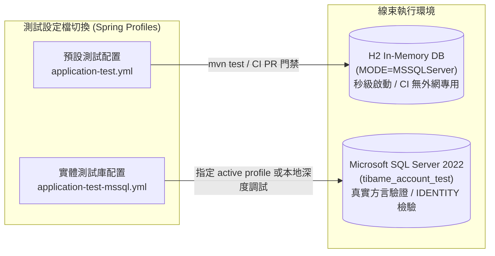

1. **H2 In-Memory 模式**：
   * 啟用 `MODE=MSSQLServer` 語法相容模式，支援標準 SQL Server 函式。
   * 執行速度極快，專門供應本機極速迴歸與 GitHub Actions PR 快速門禁。
2. **實體 MS SQL Server 測試庫模式 (`tibame_account_test`)**：
   * 專門配置於 `src/test/resources/application-test-mssql.yml`，指向獨立測試資料庫 `tibame_account_test`，徹底與正式庫 `tibame_account` 隔離。
   * **零程式碼污染**：全數透過 Spring Profile 與環境變數注入，正式代碼無需任何修改。
   * **交易回滾與動態主鍵隔離**：搭配 `@Transactional`，測試結束自動回滾髒資料；斷言邏輯基於業務鍵或動態抓取之 ID，防範 SQL Server `IDENTITY(1,1)` 跨測試跳號問題。

---

### 4.4 集中式測試固件與使用者工廠 (Fixtures & User Factory)

為杜絕測試代碼重複構造資料造成維護困難，線束提供集中式輔助固件：
* **[TestUserFactory](file:///c:/Arvin/GitHub/Tibame_Java2026/Tibame_Java2026/src/test/java/com/tibame/e2e/base/TestUserFactory.java)**：
  * 自動產生唯一隨機測試帳號（如 `user_1710928374`），避免多測試案例間帳號衝突。
  * 封裝快速註冊與登入邏輯，自動提取並快取可用之 JWT Bearer Token。
* **[IntegrationTestBase](file:///c:/Arvin/GitHub/Tibame_Java2026/Tibame_Java2026/src/test/java/com/tibame/integration/base/IntegrationTestBase.java)**：
  * 統一標註 `@SpringBootTest(webEnvironment = SpringBootTest.WebEnvironment.MOCK)` 與 `@AutoConfigureMockMvc`。
  * 內建 `ObjectMapper` 序列化輔助、Token 偽造器、標頭構造器，以及自動交易回滾機制，所有業務整合測試繼承此基底即可立即使用。

---

### 4.5 Page Object Model (POM) 真機瀏覽器線束

在 UI 端到端測試中，專案採用業界標準的 **Page Object Model (POM)** 設計模式，將頁面 DOM 操作細節與測試驗證邏輯徹底解耦：

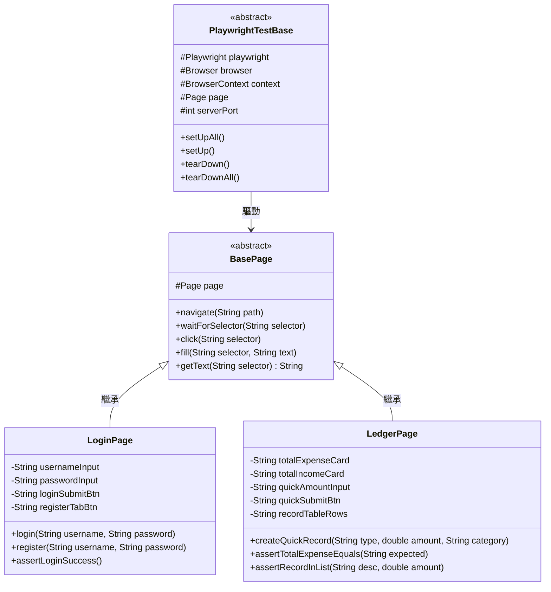

* **[PlaywrightTestBase](file:///c:/Arvin/GitHub/Tibame_Java2026/Tibame_Java2026/src/test/java/com/tibame/e2e/base/PlaywrightTestBase.java)**：負責 Playwright 生命週期管理，依據環境變數動態切換無頭模式 (Headless) 或有頭除錯模式 (Headed，搭配 SlowMo 慢速回放)。
* **[LoginPage](file:///c:/Arvin/GitHub/Tibame_Java2026/Tibame_Java2026/src/test/java/com/tibame/e2e/pages/LoginPage.java) 與 [LedgerPage](file:///c:/Arvin/GitHub/Tibame_Java2026/Tibame_Java2026/src/test/java/com/tibame/e2e/pages/LedgerPage.java)**：提供高階業務語義方法（如 `ledgerPage.createQuickRecord(...)`），使測試案例具備極高的可讀性與抗 UI 改版能力。

---

## 5. 持續整合 (CI/CD) 與規格治理線束 (CI/CD & Governance Harness)

### 5.1 GitHub Actions 雙層品質守門管線

為兼顧「Pull Request 階段的極速反饋」與「主幹發布階段的絕對深度」，專案建立雙層分流 CI 管線：

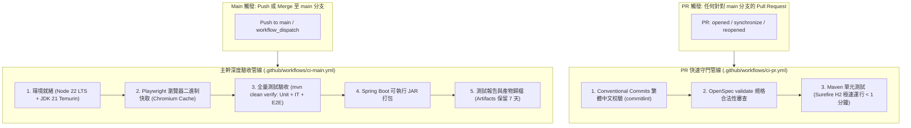

1. **PR 快速門禁 (`ci-pr.yml`)**：
   * **Commit 繁中規範檢驗**：強制遵守 `<type>(<scope>): <繁體中文簡述>` 格式，主旨若非繁體中文立即阻斷。
   * **規格同步驗證**：自動執行 `openspec validate`，確保規格未脫節。
   * **秒級單元測試**：僅執行 H2 記憶體單元測試，1 分鐘內即刻在 GitHub PR 介面回報 Check 狀態。
2. **主幹深度驗收 (`ci-main.yml`)**：
   * **瀏覽器二進制快取機制**：利用 GitHub Actions Cache 機制快取 Linux Playwright Chromium 二進制檔案，節省每次重複下載的數百 MB 頻寬與時間。
   * **全量端到端打通**：執行 `mvn clean verify`，確保單元、整合與真機 UI E2E 全數綠燈通過。
   * **產物歸檔**：自動打包並歸檔包含測試報表與可執行 JAR 包。

---

### 5.2 OpenSpec 規格驅動開發線束

專案採用 [OpenSpec](file:///c:/Arvin/GitHub/Tibame_Java2026/Tibame_Java2026/openspec/) 治理框架，將開發與重構約束於規格之下：
* **雙軌目錄結構**：
  * **探索文件軌 (`docs/explorations/`)**：記錄架構選型、方案 A/B 評估、IDE 排查與歷史脈絡。
  * **正式規範軌 (`docs/specifications/`)**：單一真實來源 (SSOT)，包含 `01` 到 `10` 號正式規格書、資料庫 DDL、操作手冊與測試清單。
* **交付定義檢核 (DoD)**：代碼交付前必須通過代碼潔淨度（Zero Warning）、架構分層無跨層依賴、測試覆蓋率達標等硬性條款。

---

### 5.3 start.ps1 智慧本機維運與啟動線束

專案提供高智慧度維運啟動腳本 [start.ps1](file:///c:/Arvin/GitHub/Tibame_Java2026/Tibame_Java2026/start.ps1)，提供極致的開發體驗：
* **環境依賴自動嗅探**：依序檢測本機 JDK 21、PowerShell 執行權限、本機 MS SQL Server 1433 連線狀態。
* **智慧降級切換**：
  * 若指定 `.\start.ps1 -Offline`，自動切換為純 H2 記憶體模式啟動，無需安裝任何外部資料庫。
  * 若未安裝資料庫，腳本主動提示並建議以離線模式秒級啟動。
* **非同步瀏覽器健康巡檢**：
  * 啟動後於背景輪詢 `http://localhost:8080/actuator/health` 或端點就緒狀態，待服務健康上線後，自動啟動系統預設瀏覽器導向首頁。

---

## 6. 資料庫模型與實體關聯圖 (Database Schema & ERD)

系統資料庫採用標準關聯模型設計，具備完善之外鍵約束與索引用以保證 ACID 特性：

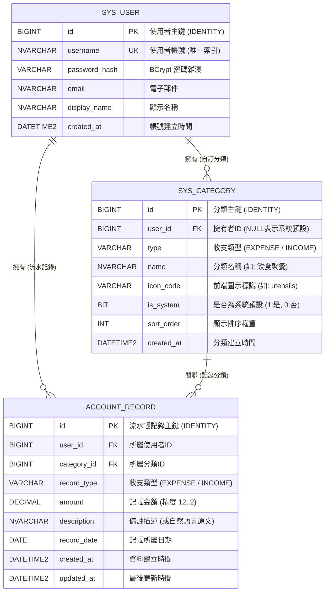

---

## 7. 核心業務時序推演 (Sequence Diagrams)

### 7.1 認證鑑權與多租戶存取時序

展示使用者從登入換取 Token，到後續帶著 Token 發起資料操作之完整時序流向：

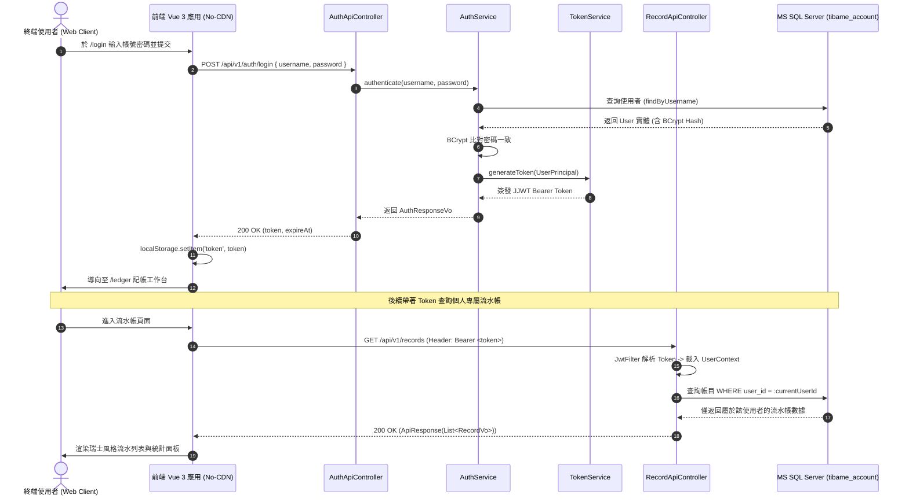

---

### 7.2 結構化與 NLP 快速記帳時序

展示使用者採用 Option A (結構化表單) 或 Option B (自然語言語句) 進行快速記帳並觸發即時統計更新的後端流向：

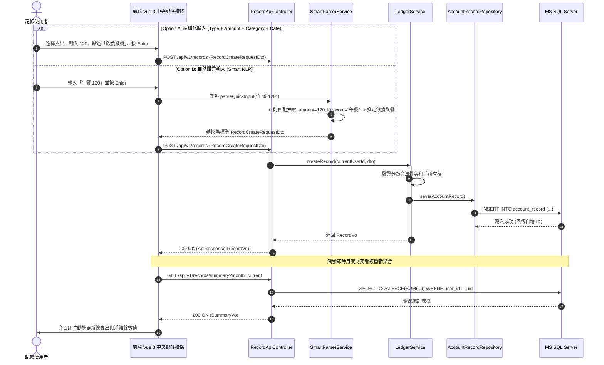

---

## 8. 結論與架構亮點總結 (Conclusion & Key Highlights)

本專案「**日常流水帳系統 (Daily Ledger System)**」透過嚴謹的軟體工程實踐，將業務功能實現與工程品質治理提升至高標準。總結專案之六大核心架構亮點：

1. **全方位立體化 Harness 驗證網絡**：
   * 構築起由 **66 個純記憶體單元測試 (Surefire)**、**7 大盲區整合測試 (Failsafe)** 與 **Chromium 真機端到端測試 (Playwright POM)** 組成的完整金字塔測試體系，全流程自動化覆蓋。
2. **雙資料庫無縫切換架構 (Dual-DB Architecture)**：
   * 既能享受 H2 In-Memory 在本機與 CI/CD 環境中的秒級反饋，又能透過 `application-test-mssql.yml` 於實體獨立資料庫 `tibame_account_test` 上精準檢驗真實方言、約束與交易回滾。
3. **極致嚴密的資訊安全與租戶隔離**：
   * 實施 Git 零機密原則、JWT 強型別配置治理、啟動期 Fail-Fast 檢核，搭配 ThreadLocal 安全上下文與 `finally` 銷毀保證，徹底杜絕執行緒身分污染與跨租戶越權漏洞。
4. **獨樹一幟的純離線瑞士美學 (No-CDN Swiss Style)**：
   * 100% 離線本地封裝，不依賴任何外部 CDN 網路；以客觀、理性、高對比的直角幾何排版與瑞士紅標誌，提供專注且高效的記帳視覺體驗。
5. **雙層持續整合品質守門 (Two-Tier CI Pipeline)**：
   * GitHub Actions 配置 PR 快速門禁（繁中規範、OpenSpec 驗證、秒級測試）與 Main 主幹深度驗收（Playwright 瀏覽器快取、全量 Verify 打包與產物歸檔），杜絕任何瑕疵代碼流入主幹。
6. **規格驅動開發與雙軌文檔體系 (OpenSpec & SSOT)**：
   * 以 OpenSpec 規格契約為綱領，透過「探索軌 (`docs/explorations/`)」與「規範軌 (`docs/specifications/`)」嚴格管理專案技術資產與生命週期，確保架構演進始終有跡可循、單一真實。

---

### 相關文件與快速導覽鏈結

* 📚 **文件總覽與治理門戶**：[docs/README.md](file:///c:/Arvin/GitHub/Tibame_Java2026/Tibame_Java2026/docs/README.md)
* 📋 **業務功能規格書契約**：[02_functional_specifications.md](file:///c:/Arvin/GitHub/Tibame_Java2026/Tibame_Java2026/docs/specifications/daily_ledger_system/02_functional_specifications.md)
* 📐 **系統分層架構與類別設計**：[03_system_architecture_and_design.md](file:///c:/Arvin/GitHub/Tibame_Java2026/Tibame_Java2026/docs/specifications/daily_ledger_system/03_system_architecture_and_design.md)
* 🧪 **單元測試操作手冊與案例目錄**：[09_unit_testing_guide_and_test_catalog.md](file:///c:/Arvin/GitHub/Tibame_Java2026/Tibame_Java2026/docs/specifications/daily_ledger_system/09_unit_testing_guide_and_test_catalog.md)
* 🎭 **Playwright E2E 真機測試操作手冊**：[10_e2e_testing_guide_and_operation_manual.md](file:///c:/Arvin/GitHub/Tibame_Java2026/Tibame_Java2026/docs/specifications/daily_ledger_system/10_e2e_testing_guide_and_operation_manual.md)
* 🔬 **整合測試範疇、策略與 SQL Server 介接報告 (v3.0)**：[integration_testing_scope_and_strategy_exploration_v3.0.md](file:///c:/Arvin/GitHub/Tibame_Java2026/Tibame_Java2026/docs/explorations/integration_testing_scope_and_strategy_exploration_v3.0.md)
* 🛠️ **GitHub Actions CI/CD 管線與分支保護指南**：[github-actions-ci-guide.md](file:///c:/Arvin/GitHub/Tibame_Java2026/Tibame_Java2026/docs/guides/github-actions-ci-guide.md)
* 🚀 **智慧啟動腳本與維運手冊**：[07_startup_script_and_devops_guide.md](file:///c:/Arvin/GitHub/Tibame_Java2026/Tibame_Java2026/docs/specifications/daily_ledger_system/07_startup_script_and_devops_guide.md)
