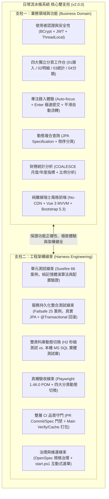
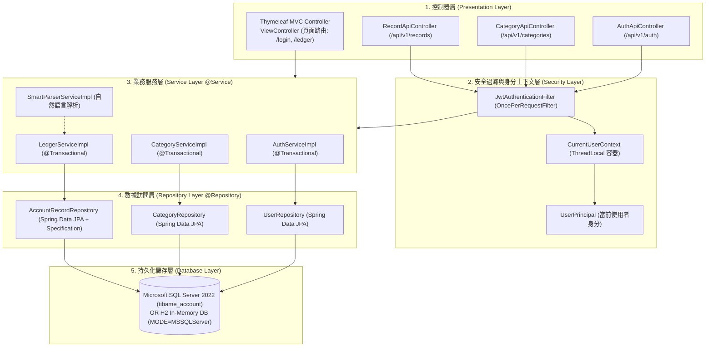
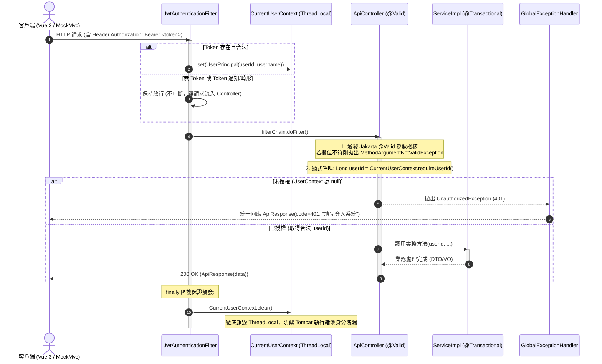
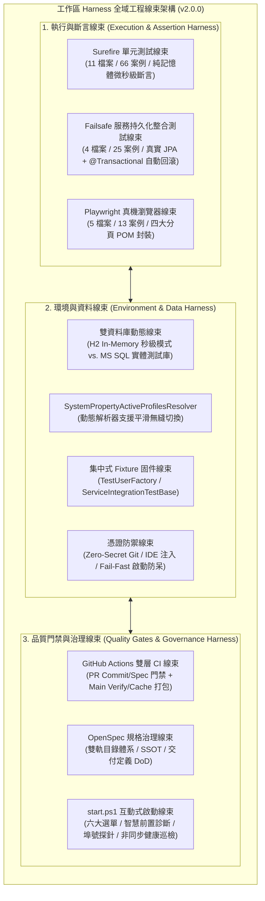
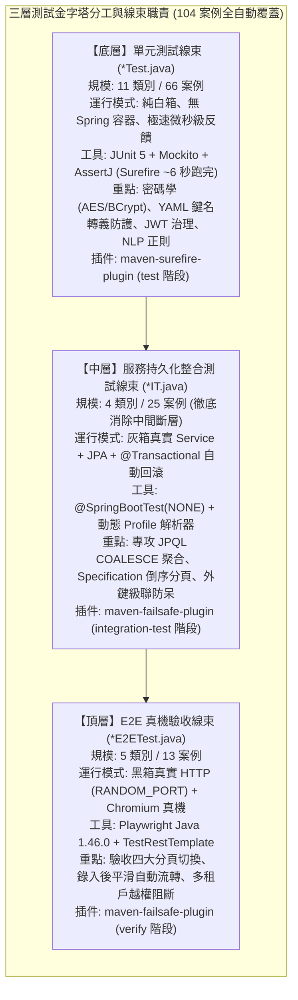
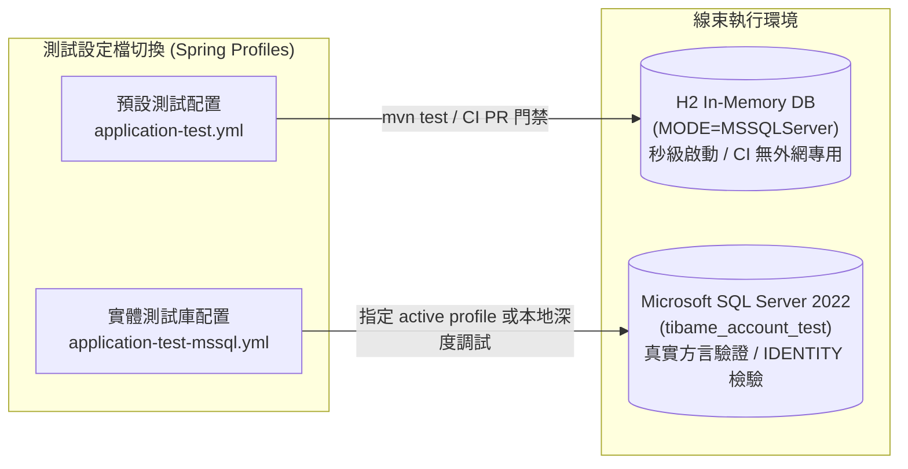
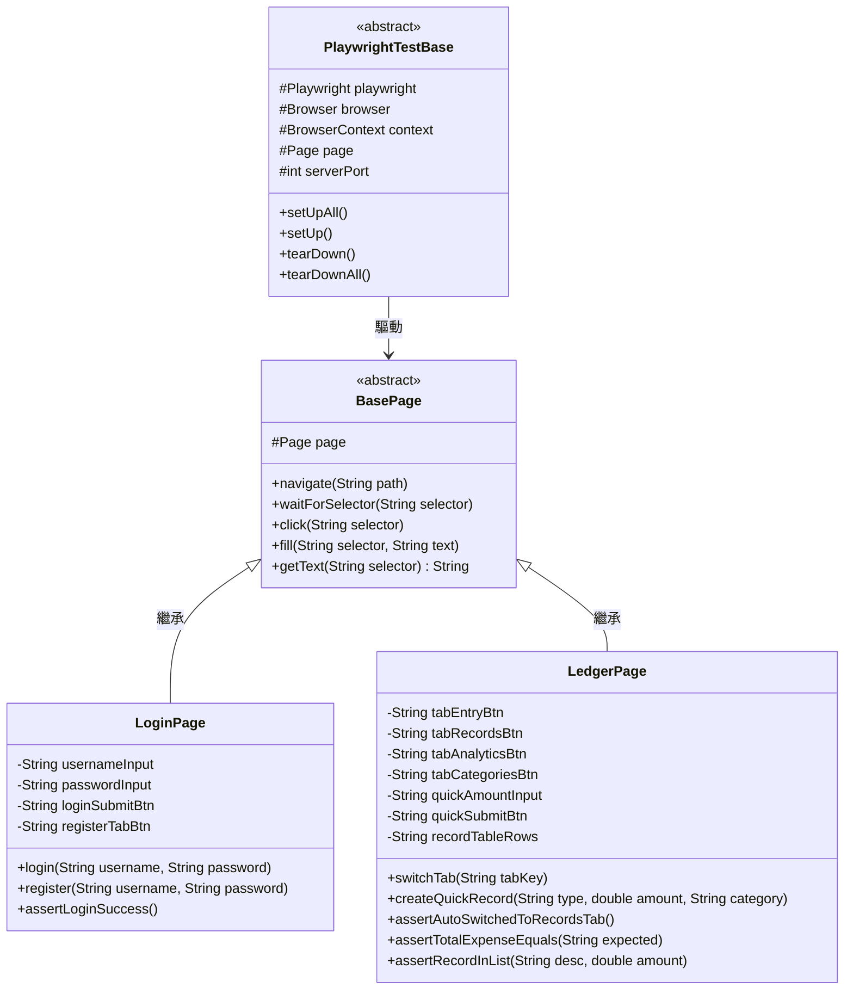
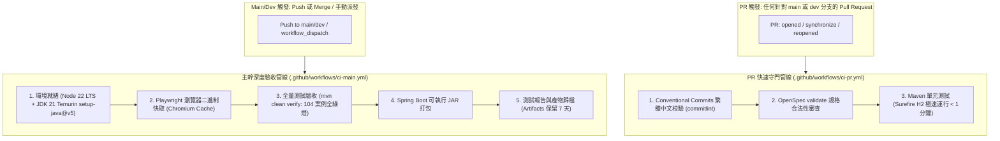
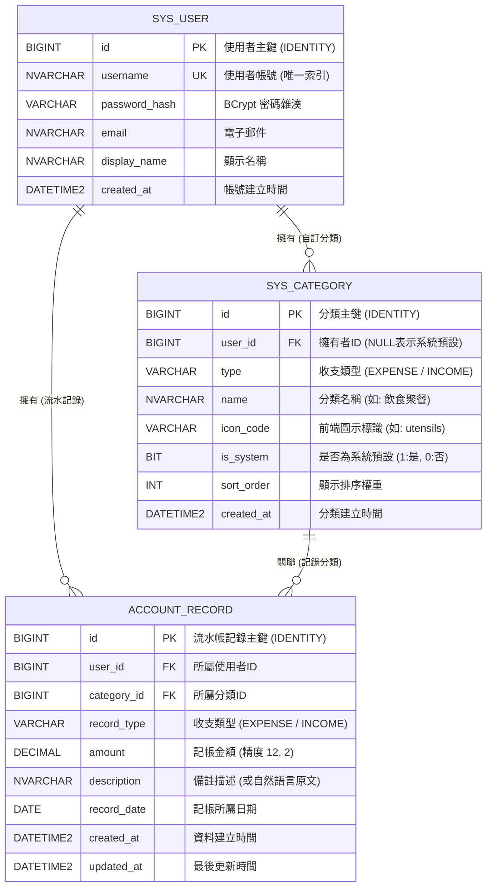
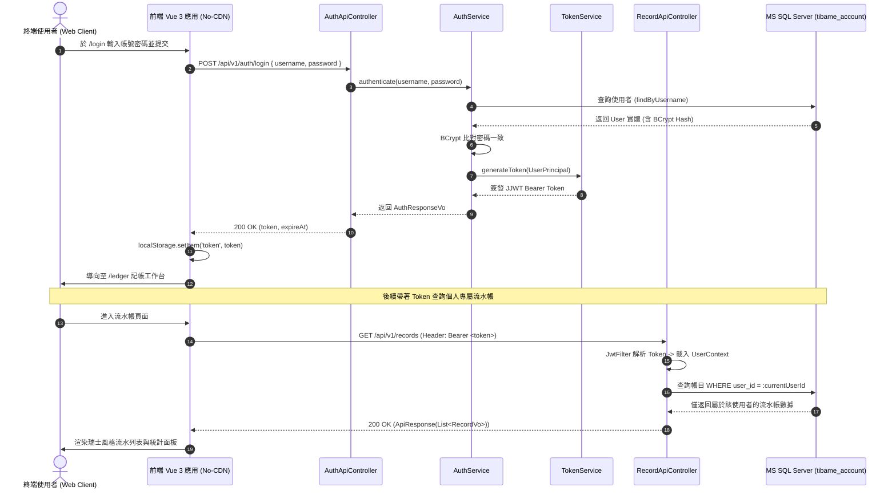

# 日常流水帳系統 (Daily Ledger System) — 工作區 Harness 工程架構與專案功能深度說明報告

> **文件版本**：v2.0.0 (全景架構升級版)  
> **產出日期**：2026-09-05  
> **系統名稱**：日常流水帳系統 (Daily Ledger System)  
> **核心技術棧**：Java 21 (Temurin) ｜ Spring Boot 3.3.13 ｜ Spring Data JPA ｜ MS SQL Server 2022 & H2 In-Memory ｜ Microsoft Playwright for Java 1.46.0 ｜ Vue 3 MVVM (Tabbed Workbench) ｜ Bootstrap 5.3.3 (Strict No-CDN 瑞士風格) ｜ OpenSpec 規格治理  
> **文件定位**：全域工程架構線束 (Harness Engineering) 深度解析、四大分頁工作台與業務功能完整說明報告  
> **版本關係**：本文件為 v2.0.0 最新版本；歷史初始版本請參閱 [daily_ledger_system_harness_and_feature_brief.md](daily_ledger_system_harness_and_feature_brief.md) (v1.0.0)。

---

## 報告目錄導覽 (Table of Contents)

1. [執行摘要 (Executive Summary)](#1-執行摘要-executive-summary)
2. [專案功能全景與業務領域模型 (Project Features & Business Domains)](#2-專案功能全景與業務領域模型-project-features--business-domains)
   - [2.1 身分認證與帳號安全領域 (Authentication & Security)](#21-身分認證與帳號安全領域-authentication--security)
   - [2.2 雙層樹狀收支分類與獨立分頁管理 (Category Management)](#22-雙層樹狀收支分類與獨立分頁管理-category-management)
   - [2.3 專注記帳錄入與自動流轉體驗 (Focus Entry & Smooth Flow)](#23-專注記帳錄入與自動流轉體驗-focus-entry--smooth-flow)
   - [2.4 多維度交易明細檢索與倒序分頁 (Transaction Ledger & Search)](#24-多維度交易明細檢索與倒序分頁-transaction-ledger--search)
   - [2.5 智慧自然語言快速記帳解析領域 (Smart NLP Parsing)](#25-智慧自然語言快速記帳解析領域-smart-nlp-parsing)
   - [2.6 多維度財務彙總與統計看板領域 (Financial Analytics)](#26-多維度財務彙總與統計看板領域-financial-analytics)
   - [2.7 純離線瑞士風格四大分頁工作台 (Swiss Style Tabbed Workbench)](#27-純離線瑞士風格四大分頁工作台-swiss-style-tabbed-workbench)
3. [系統分層技術架構與安全防護鏈 (System Architecture & Security Pipeline)](#3-系統分層技術架構與安全防護鏈-system-architecture--security-pipeline)
   - [3.1 後端四層分層架構](#31-後端四層分層架構)
   - [3.2 輕量自訂安全過濾鏈與例外轉譯真實鏈路](#32-輕量自訂安全過濾鏈與例外轉譯真實鏈路)
4. [工作區 Harness 工程架構體系深度解析 (Harness Engineering Architecture)](#4-工作區-harness-工程架構體系深度解析-harness-engineering-architecture)
   - [4.1 什麼是工作區的「Harness 工程體系」？](#41-什麼是工作區的-harness-工程體系)
   - [4.2 三層測試金字塔線束全景 (Multi-Tier Test Harness: 104 案例全覆蓋)](#42-三層測試金字塔線束全景-multi-tier-test-harness-104-案例全覆蓋)
   - [4.3 服務層持久化整合測試線束 (Service Persistence IT Harness)](#43-服務層持久化整合測試線束-service-persistence-it-harness)
   - [4.4 雙資料庫測試線束切換機制 (Dual-Database Test Harness)](#44-雙資料庫測試線束切換機制-dual-database-test-harness)
   - [4.5 集中式測試固件與使用者工廠 (Fixtures & User Factory)](#45-集中式測試固件與使用者工廠-fixtures--user-factory)
   - [4.6 Page Object Model (POM) 真機瀏覽器線束 (四大分頁適配)](#46-page-object-model-pom-真機瀏覽器線束-四大分頁適配)
5. [持續整合 (CI/CD) 與規格治理線束 (CI/CD & Governance Harness)](#5-持續整合-cicd-與規格治理線束-cicd--governance-harness)
   - [5.1 GitHub Actions 雙層品質守門管線 (Node 22 LTS + setup-java@v5)](#51-github-actions-雙層品質守門管線-node-22-lts--setup-javav5)
   - [5.2 OpenSpec 規格驅動開發線束](#52-openspec-規格驅動開發線束)
   - [5.3 start.ps1 互動式維運與啟動線束](#53-startps1-互動式維運與啟動線束)
6. [資料庫模型與實體關聯圖 (Database Schema & ERD)](#6-資料庫模型與實體關聯圖-database-schema--erd)
7. [核心業務時序推演 (Sequence Diagrams)](#7-核心業務時序推演-sequence-diagrams)
   - [7.1 認證鑑權與多租戶存取時序](#71-認證鑑權與多租戶存取時序)
   - [7.2 專注記帳錄入與自動流轉明細時序](#72-專注記帳錄入與自動流轉明細時序)
8. [結論與架構亮點總結 (Conclusion & Architecture Highlights)](#8-結論與架構亮點總結-conclusion--architecture-highlights)

---

## 1. 執行摘要 (Executive Summary)

「**日常流水帳系統 (Daily Ledger System)**」是一套融合企業級後端工程標準、純離線現代化前端架構、嚴密自動化工程線束 (Harness Engineering) 以及瑞士國際主義極簡美學的個人財務流水帳管理系統。

本報告旨在針對專案之**兩大核心軸心**進行系統化、透明化的技術盤點與架構總覽：
1. **專案功能說明 (Business & Features)**：從認證、分類獨立管理、專注記帳錄入、提交後平滑自動流轉、明細多條件篩選到獨立統計看板的四大分頁工作台業務規格。
2. **工作區 Harness 工程架構說明 (Harness Engineering)**：解構工作區如何透過**單元測試線束 (Surefire 66 案例)**、**服務層持久化整合測試線束 (Failsafe 25 案例，消弭中間斷層)**、**端到端真機驗收線束 (Playwright POM 13 案例)**、**雙資料庫動態切換 (H2 vs. MSSQL)**、**GitHub Actions 雙層 CI 門禁**以及 **OpenSpec 規格治理**，構成一套覆蓋 **104 個全自動化驗證點** 的零盲區軟體工程驗證體系。



---

## 2. 專案功能全景與業務領域模型 (Project Features & Business Domains)

日常流水帳系統的業務核心圍繞於「極致專注記帳、獨立階層分類、直覺查詢檢索與多維度財務洞察」。系統以**四大分頁工作台 (Tabbed Ledger Workbench)** 為載體，劃分出六大核心業務領域：

### 2.1 身分認證與帳號安全領域 (Authentication & Security)

系統提供無狀態、多租戶隔離的現代化安全防護機制：
* **使用者註冊 (`POST /api/v1/auth/register`)**：
  * 使用者名稱唯一性校驗 (`sys_user.username`) 與電子郵件唯一性校驗 (`sys_user.email`)。
  * 密碼強度檢核：透過 [PasswordPolicyValidator](file:///c:/Arvin/GitHub/Tibame_Java2026/Tibame_Java2026/src/main/java/com/tibame/common/crypto/password/PasswordPolicyValidator.java) 進行長度與字元組合（英數字/特殊符號）強制校驗。
  * 密碼雜湊防護：採用標準 BCrypt 鹽值雜湊演算法存入資料庫，嚴禁明文落盤。
* **登入與權限簽發 (`POST /api/v1/auth/login`)**：
  * 帳號密碼校驗成功後，簽發基於 HMAC-SHA256 的無狀態 JJWT Bearer Token。
  * Token 內含使用者識別碼 (`userId`) 與帳號 (`username`)，具備動態過期時間戳機制。
* **身分上下文裝載 (`GET /api/v1/auth/me`)**：
  * 依據請求 Header 之 Bearer Token，即時解析並返回目前登入者身分資訊，供前端進行身分狀態維持。
* **租戶存取強制隔離**：
  * 系統所有流水帳與自訂分類均嚴格綁定 `userId`，底層 SQL 自動附加租戶約束條件，杜絕越權存取漏洞。

### 2.2 雙層樹狀收支分類與獨立分頁管理 (Category Management)

分類體系具備雙層樹狀結構與系統/自訂動態混合能力，並自原彈窗升級為**獨立全版工作台 (`TAB-04 // 分類管理`)**：
* **系統預設分類與使用者自訂分類並存**：
  * **系統預設 (`is_system = 1`)**：由系統資料庫種子資料預先載入（如餐飲聚餐、交通出行、日常用品、居住水電、薪資所得、投資理財等 11 種預設類別），`user_id` 為 NULL。
  * **個人自訂 (`is_system = 0`)**：使用者可依自身需求建立私有自訂分類，強制寫入當前 `user_id`。
* **動態查詢合併**：
  * 執行 `GET /api/v1/categories` 時，後端自動執行聯集：`(is_system = 1 AND user_id IS NULL) UNION (is_system = 0 AND user_id = :currentUserId)`，並按 `sort_order` 與 `id` 升冪排序。
* **嚴密刪除防呆保護 (409 Conflict)**：
  * **系統內建保護**：禁止修改或刪除任何 `is_system = 1` 之類別。
  * **外鍵依賴保護**：若欲刪除之自訂分類已被流水帳記錄（`account_record`）引用，系統立即拒絕刪除並返回 HTTP 409 衝突錯誤，確保資料庫完整性。

### 2.3 專注記帳錄入與自動流轉體驗 (Focus Entry & Smooth Flow)

系統建立專屬**「01 記帳錄入」獨立分頁視圖**，極大化提升錄入專注度與作業效率：
* **結構化快速記帳 (Option A)**：
  * 支援收支類型切換 (`EXPENSE` 支出 / `INCOME` 收入)。
  * 金額精度檢核：限制大於零之正數，支援小數點後兩位 (`Decimal(12,2)`)。
  * 關聯指定分類、自訂日期（預設為今日）與備註摘要。
* **自動聚焦機制 (Auto-focus)**：
  * 頁面載入完成或使用者點擊切換至「01 記帳錄入」分頁時，游標自動聚焦至金額輸入框，支援即開即記。
* **Enter 極速提交與平滑自動流轉**：
  * 填寫完成後於輸入框按下 Enter 鍵即可極速提交。
  * 後端落盤完成後，前端介面自動平滑流轉至「02 交易明細」分頁，並立即觸發明細列表與摘要看板更新，大幅降低操作摩擦。

### 2.4 多維度交易明細檢索與倒序分頁 (Transaction Ledger & Search)

獨立的**「02 交易明細」工作台**提供完整的數據檢索與單筆維護：
* **多維度動態複合搜尋**：
  * 透過 Spring Data JPA `Specification` 實現動態 SQL 組合查詢：
    * 關鍵字模糊查詢（`keyword` 匹配描述備註）。
    * 分類過濾（`categoryId` 精確匹配）。
    * 收支類型過濾（`recordType` EXPENSE / INCOME）。
    * 日期區間篩選（`startDate` 至 `endDate` 範圍判定）。
* **高效倒序分頁**：
  * 預設按 `recordDate DESC, id DESC` 進行倒序分頁呈現，保障大數據量下的讀取效能。
* **單筆維護與租戶防護**：
  * 支援行內記錄查詢 (`GET /api/v1/records/{id}`)、內容更新 (`PUT /api/v1/records/{id}`) 與實體刪除 (`DELETE /api/v1/records/{id}`)，均具備租戶所有權校驗。

### 2.5 智慧自然語言快速記帳解析領域 (Smart NLP Parsing)

為降低終端使用者的輸入摩擦，系統內建自然語言語意解析服務：
* **語句快速解析 (Option B 擴展)**：
  * 透過 [SmartParserService](file:///c:/Arvin/GitHub/Tibame_Java2026/Tibame_Java2026/src/main/java/com/tibame/service/SmartParserService.java)，使用者可於專注錄入分頁直接輸入日常語句（如：「午餐 120」、「買手搖飲 65 飲料」、「薪資所得 55000」）。
* **模式比對與屬性提取**：
  * 利用正規表示式引擎自動抽取出數值金額、推定收支屬性，並依關鍵字權重模糊匹配至最佳分類，組裝為標準 `RecordCreateRequestDto` 自動落庫。

### 2.6 多維度財務彙總與統計看板領域 (Financial Analytics)

獨立的**「03 統計分析」工作台**提供透明即時的財務指標：
* **即時財務看板指標 (`GET /api/v1/records/summary`)**：
  * 針對當月（或指定月度）自動聚合計算三大關鍵指標：
    1. **總支出 (Total Expense)**
    2. **總收入 (Total Income)**
    3. **淨結餘 (Net Balance = Total Income - Total Expense)**
  * 資料庫層使用 SQL `COALESCE(SUM(amount), 0)` 進行聚合計算，確保在無記錄時安全返回 0.00 而非 NULL。
* **可視化比例分析**：
  * 按各分類計算支出比例，支援進度條與視覺化呈現，讓使用者一眼看穿消費重點。

### 2.7 純離線瑞士風格四大分頁工作台 (Swiss Style Tabbed Workbench)

* **Strict No-CDN 離線封箱機制**：
  * 專案內建所有前端資源於 `src/main/resources/static/lib/`，嚴禁任何外網 CDN (cdnjs/unpkg/jsdelivr/google fonts) 引用，具備 100% 氣隙隔離 (Air-Gapped) 運行能力。
  * 本地庫包含：Bootstrap 5.3.3、Vue 3.4.x (Composition API)、Axios 1.7.x、SweetAlert2 11.x。
* **瑞士國際主義風格 (Swiss Design Style)**：
  * 設計哲學：形式服從功能、客觀、理性與秩序。
  * 視覺元素：白灰黑幾何底色、經典瑞士紅 (`#DC2626`) 重點標記、直角無圓角 (`border-radius: 0px`)、無模糊陰影、嚴謹非對稱網格佈局、工業風格編號標籤 (`SYS-LEDGER // 01`)。
  * 四大分頁標籤按鈕 (`.swiss-tabs`, `.swiss-tab-btn`)，搭配專注錄入容器樣式。

---

## 3. 系統分層技術架構與安全防護鏈 (System Architecture & Security Pipeline)

### 3.1 後端四層分層架構

系統嚴格遵循 Spring Boot 標準四層架構原則，層級之間單向依賴，禁止越權調用：



### 3.2 輕量自訂安全過濾鏈與例外轉譯真實鏈路

本專案摒棄重型 Spring Security FilterChain 設定，採用精巧透明的自訂安全性過濾與上下文管理機制。此機制確保了高吞吐量與極清晰的例外處理流向：



---

## 4. 工作區 Harness 工程架構體系深度解析 (Harness Engineering Architecture)

### 4.1 什麼是工作區的「Harness 工程體系」？

在現代軟體工程中，「**Harness（測試與工程線束）**」是指**包覆、驅動、監控並驗證整套系統行為的全面自動化工程基建**。它如同汽車出廠測試台上的線束傳感器，將被測目標（System Under Test, SUT）從外圍硬體、網路與環境依賴中解耦，提供**可重複執行、高保真度、無人工干預且能自我診斷的驗收迴路**。

在 `Tibame_Java2026` 工作區中，Harness 工程體系具體由三大層級緊密咬合構成：



---

### 4.2 三層測試金字塔線束全景 (Multi-Tier Test Harness: 104 案例全覆蓋)

專案測試架構嚴格遵循測試金字塔原理，透過 Maven 插件分流機制（Surefire 與 Failsafe）將測試職責劃分為三層，全量案例達 **104 個全自動化測試**：



#### 各層線束實裝與盤點對照表

| 測試層級 | 執行插件 | 檔案命名規範 | 測試數量 | 啟動成本 | 守備核心與驗收重點 | 關鍵測試類別檔案連結 |
| :--- | :--- | :--- | :--- | :--- | :--- | :--- |
| **單元測試層 (Unit)** | `maven-surefire-plugin` | `*Test.java` | 66 案例 | ~6 秒 (無容器) | 密碼學加密、密碼強度政策、YAML 設定轉義防護、JWT 治理、NLP 解析、純業務運算 | [PasswordPolicyValidatorTest](file:///c:/Arvin/GitHub/Tibame_Java2026/Tibame_Java2026/src/test/java/com/tibame/common/crypto/password/PasswordPolicyValidatorTest.java)<br>[CryptoServiceTest](file:///c:/Arvin/GitHub/Tibame_Java2026/Tibame_Java2026/src/test/java/com/tibame/common/crypto/cipher/CryptoServiceTest.java)<br>[SmartParserServiceTest](file:///c:/Arvin/GitHub/Tibame_Java2026/Tibame_Java2026/src/test/java/com/tibame/SmartParserServiceTest.java)<br>[CategoryServiceTest](file:///c:/Arvin/GitHub/Tibame_Java2026/Tibame_Java2026/src/test/java/com/tibame/service/CategoryServiceTest.java)<br>[LedgerServiceTest](file:///c:/Arvin/GitHub/Tibame_Java2026/Tibame_Java2026/src/test/java/com/tibame/service/LedgerServiceTest.java) |
| **整合測試層 (IT)** | `maven-failsafe-plugin` | `*IT.java` | 25 案例 | ~2~3 秒 (Context 快取) | 服務層真實持久化、JPQL COALESCE 聚合計算精度、動態 Specification 查詢、外鍵刪除衝突防呆 (409)、類別級事務回滾 | [ServiceIntegrationTestBase](file:///c:/Arvin/GitHub/Tibame_Java2026/Tibame_Java2026/src/test/java/com/tibame/integration/base/ServiceIntegrationTestBase.java)<br>[AuthServicePersistenceIT](file:///c:/Arvin/GitHub/Tibame_Java2026/Tibame_Java2026/src/test/java/com/tibame/integration/service/AuthServicePersistenceIT.java)<br>[CategoryServicePersistenceIT](file:///c:/Arvin/GitHub/Tibame_Java2026/Tibame_Java2026/src/test/java/com/tibame/integration/service/CategoryServicePersistenceIT.java)<br>[LedgerServicePersistenceIT](file:///c:/Arvin/GitHub/Tibame_Java2026/Tibame_Java2026/src/test/java/com/tibame/integration/service/LedgerServicePersistenceIT.java) |
| **端到端驗收層 (E2E)** | `maven-failsafe-plugin` | `*E2ETest.java` | 13 案例 | ~15~25 秒 (全量真機) | 四大分頁切換驗收、錄入後平滑自動流轉斷言、多租戶越權穿透阻斷 (`TenantIsolation`)、Chromium 真機瀏覽器渲染 | [PlaywrightTestBase](file:///c:/Arvin/GitHub/Tibame_Java2026/Tibame_Java2026/src/test/java/com/tibame/e2e/base/PlaywrightTestBase.java)<br>[AccountingFlowUiE2ETest](file:///c:/Arvin/GitHub/Tibame_Java2026/Tibame_Java2026/src/test/java/com/tibame/e2e/ui/AccountingFlowUiE2ETest.java)<br>[AuthFlowUiE2ETest](file:///c:/Arvin/GitHub/Tibame_Java2026/Tibame_Java2026/src/test/java/com/tibame/e2e/ui/AuthFlowUiE2ETest.java)<br>[TenantIsolationSecurityE2ETest](file:///c:/Arvin/GitHub/Tibame_Java2026/Tibame_Java2026/src/test/java/com/tibame/e2e/api/TenantIsolationSecurityE2ETest.java) |

---

### 4.3 服務層持久化整合測試線束 (Service Persistence IT Harness)

本線束專門解決傳統架構中「單元測試過度依賴 Mockito 偽造 Repository」與「全端 E2E 難以覆蓋底層交易細節」的斷層問題：
* **[ServiceIntegrationTestBase](file:///c:/Arvin/GitHub/Tibame_Java2026/Tibame_Java2026/src/test/java/com/tibame/integration/base/ServiceIntegrationTestBase.java)**：
  * 標註 `@SpringBootTest(webEnvironment = SpringBootTest.WebEnvironment.NONE)`，免除 Web 容器負擔，反饋速度極快。
  * 標註類別層級 `@Transactional` 與 `@Rollback`，保證每個測試案例執行後資料庫 100% 自動回滾，達成**「真實持久化落盤、零髒資料殘留」**。
* **[SystemPropertyActiveProfilesResolver](file:///c:/Arvin/GitHub/Tibame_Java2026/Tibame_Java2026/src/test/java/com/tibame/integration/base/SystemPropertyActiveProfilesResolver.java)**：
  * 自訂動態設定檔解析器，優先讀取 JVM 系統屬性 `-Dspring.profiles.active`。若未指定則預設採用 `test` (H2 In-Memory)；若傳入 `test-mssql` 則自動切換至本機實體 MS SQL Server 測試庫。
* **三大核心業務持久化驗證矩陣**：
  1. **認證服務持久化 ([AuthServicePersistenceIT](file:///c:/Arvin/GitHub/Tibame_Java2026/Tibame_Java2026/src/test/java/com/tibame/integration/service/AuthServicePersistenceIT.java))**：
     * 檢驗註冊後密碼雜湊確實在 DB 落盤，且能被 `passwordEncoder.matches()` 正確比對。
     * 檢驗重複帳號拋出 `IllegalArgumentException`，重複 Email 觸發資料庫約束阻斷。
  2. **分類服務持久化 ([CategoryServicePersistenceIT](file:///c:/Arvin/GitHub/Tibame_Java2026/Tibame_Java2026/src/test/java/com/tibame/integration/service/CategoryServicePersistenceIT.java))**：
     * 驗證系統預設分類之修改與刪除阻斷防護。
     * 驗證租戶資料隔離（使用者 A 無法看見或維護使用者 B 的自訂類別）。
     * 驗證外鍵刪除防呆：當自訂類別已被流水記錄引用時，刪除操作拋出 HTTP 409 衝突。
  3. **流水帳服務持久化 ([LedgerServicePersistenceIT](file:///c:/Arvin/GitHub/Tibame_Java2026/Tibame_Java2026/src/test/java/com/tibame/integration/service/LedgerServicePersistenceIT.java))**：
     * 驗證月度統計 JPQL `COALESCE(SUM(amount), 0)` 聚合計算精準度（無記錄時精確回傳 0.00）。
     * 驗證動態多條件 Specification 查詢與倒序分頁語法合法性。
     * 驗證跨租戶修改與刪除流水帳之嚴密阻斷。

---

### 4.4 雙資料庫測試線束切換機制 (Dual-Database Test Harness)

專案測試線束最顯著的工程特色之一，即為**支援「秒級 In-Memory」與「真機 SQL Server」雙模式切換**：



1. **H2 In-Memory 模式**：
   * 啟用 `MODE=MSSQLServer` 語法相容模式，支援標準 SQL Server 函式。
   * 執行速度極快，專門供應本機極速迴歸與 GitHub Actions PR 快速門禁。
2. **實體 MS SQL Server 測試庫模式 (`tibame_account_test`)**：
   * 專門配置於 `src/test/resources/application-test-mssql.yml`，指向獨立測試資料庫 `tibame_account_test`，徹底與正式庫 `tibame_account` 隔離。
   * **零程式碼污染**：全數透過 Spring Profile 與環境變數注入，正式代碼無需任何修改。
   * **交易回滾與動態主鍵隔離**：搭配 `@Transactional`，測試結束自動回滾髒資料；斷言邏輯基於業務鍵或動態抓取之 ID，防範 SQL Server `IDENTITY(1,1)` 跨測試跳號問題。

---

### 4.5 集中式測試固件與使用者工廠 (Fixtures & User Factory)

為杜絕測試代碼重複構造資料造成維護困難，線束提供集中式輔助固件：
* **[TestUserFactory](file:///c:/Arvin/GitHub/Tibame_Java2026/Tibame_Java2026/src/test/java/com/tibame/e2e/base/TestUserFactory.java)**：
  * 自動產生唯一隨機測試帳號（如 `user_1710928374`），避免多測試案例間帳號衝突。
  * 封裝快速註冊與登入邏輯，自動提取並快取可用之 JWT Bearer Token。
* **[IntegrationTestBase](file:///c:/Arvin/GitHub/Tibame_Java2026/Tibame_Java2026/src/test/java/com/tibame/integration/base/IntegrationTestBase.java)**：
  * 統一標註 `@SpringBootTest(webEnvironment = SpringBootTest.WebEnvironment.MOCK)` 與 `@AutoConfigureMockMvc`，支援 Web 整合測試與標頭構造。

---

### 4.6 Page Object Model (POM) 真機瀏覽器線束 (四大分頁適配)

在 UI 端到端測試中，專案採用業界標準的 **Page Object Model (POM)** 設計模式，並已全量適配四大分頁工作台：



* **[PlaywrightTestBase](file:///c:/Arvin/GitHub/Tibame_Java2026/Tibame_Java2026/src/test/java/com/tibame/e2e/base/PlaywrightTestBase.java)**：負責 Playwright 生命週期管理，依據環境變數動態切換無頭模式 (Headless) 或有頭除錯模式 (Headed，搭配 SlowMo 慢速回放)。
* **[LedgerPage](file:///c:/Arvin/GitHub/Tibame_Java2026/Tibame_Java2026/src/test/java/com/tibame/e2e/pages/LedgerPage.java)**：
  * 實作 `switchTab(tabKey)` 與 `v-show` 可見性等待機制。
  * 封裝 `assertAutoSwitchedToRecordsTab()`，驗證記帳提交後平滑自動流轉明細分頁行為。

---

## 5. 持續整合 (CI/CD) 與規格治理線束 (CI/CD & Governance Harness)

### 5.1 GitHub Actions 雙層品質守門管線 (Node 22 LTS + setup-java@v5)

為兼顧「Pull Request 階段的極速反饋」與「主幹發布階段的絕對深度」，專案建立雙層分流 CI 管線：



1. **PR 快速門禁 (`ci-pr.yml`)**：
   * **Commit 繁中規範檢驗**：強制遵守 `<type>(<scope>): <繁體中文簡述>` 格式，主旨若非繁體中文立即阻斷。
   * **規格同步驗證**：自動執行 `openspec validate`，確保規格未脫節。
   * **秒級單元測試**：僅執行 H2 記憶體單元測試，1 分鐘內即刻在 GitHub PR 介面回報 Check 狀態。
2. **主幹深度驗收 (`ci-main.yml`)**：
   * **最新環境標準**：升級採用 Node 22 LTS 與 `actions/setup-java@v5`，消除任何 EOL 棄用警告。
   * **瀏覽器快取機制**：利用 Actions Cache 快取 Linux Playwright Chromium 二進制檔案。
   * **全量端到端打通**：執行 `mvn clean verify`，確保 104 個案例全數綠燈通過。
   * **雙分支與隨選派發**：支援 `main` 與 `dev` 分支，並提供 `workflow_dispatch` 手動調度。

---

### 5.2 OpenSpec 規格驅動開發線束

專案採用 [OpenSpec](file:///c:/Arvin/GitHub/Tibame_Java2026/Tibame_Java2026/openspec/) 治理框架，將開發與重構約束於規格之下：
* **雙軌目錄結構**：
  * **探索文件軌 (`docs/explorations/`)**：記錄架構選型、方案 A/B 評估、IDE 排查與歷史脈絡。
  * **正式規範軌 (`docs/specifications/`)**：單一真實來源 (SSOT)，包含 `01` 到 `10` 號正式規格書、資料庫 DDL、操作手冊與測試清單。
* **交付定義檢核 (DoD)**：代碼交付前必須通過代碼潔淨度（Zero Warning）、架構分層無跨層依賴、測試覆蓋率達標等硬性條款。

---

### 5.3 start.ps1 互動式維運與啟動線束

專案提供高智慧度維運啟動腳本 [start.ps1](file:///c:/Arvin/GitHub/Tibame_Java2026/Tibame_Java2026/start.ps1)，支援六大互動選單與智慧診斷：
* **互動式多選單模式 (`.\start.ps1 -Interactive`)**：
  1. `[預設] H2 記憶體模式` (Port 8080，零配置秒級啟動)
  2. `MS SQL Server 模式` (Port 8080，連線本機 1433)
  3. `H2 模式 + 自動開啟瀏覽器`
  4. `MS SQL 模式 + 自動開啟瀏覽器`
  5. `乾淨重構並啟動 (Maven Clean + Run)`
  6. `開啟 JVM Remote Debug 模式 (Port 5005)`
* **智慧環境前置探針**：依序檢測 JDK 21、PowerShell 執行權限、本機 1433 埠號連線狀態與 8080 佔用檢驗。
* **非同步健康巡檢**：於背景輪詢服務端點就緒狀態，待服務健康上線後自動喚醒瀏覽器導向首頁。

---

## 6. 資料庫模型與實體關聯圖 (Database Schema & ERD)

系統資料庫採用標準關聯模型設計，具備完善之外鍵約束與索引用以保證 ACID 特性：



---

## 7. 核心業務時序推演 (Sequence Diagrams)

### 7.1 認證鑑權與多租戶存取時序

展示使用者從登入換取 Token，到後續帶著 Token 發起資料操作之完整時序流向：



---

### 7.2 專注記帳錄入與自動流轉明細時序

展示使用者在 `TAB-01` 進行記帳錄入後，後端落庫、前端自動平滑流轉至 `TAB-02` 並即時刷新列表與摘要之全鏈路時序：

```mermaid
sequenceDiagram
    autonumber
    actor User as 記帳使用者
    participant UI as 前端 Vue 3 工作台 (TAB-01 錄入)
    participant RecApi as RecordApiController
    participant Parser as SmartParserService
    participant Svc as LedgerService
    participant Repo as AccountRecordRepository
    participant DB as 資料庫 (MSSQL / H2)
    participant Table as 前端 Vue 3 工作台 (TAB-02 明細)

    alt Option A: 結構化錄入 (Type + Amount + Category + Date)
        User->>UI: 選擇支出、輸入 120、點選分類、按 Enter
        UI->>RecApi: POST /api/v1/records (RecordCreateRequestDto)
    else Option B: 自然語言輸入 (Smart NLP)
        User->>UI: 於專注輸入框輸入「午餐 120」並按 Enter
        UI->>Parser: parseQuickInput("午餐 120")
        Parser-->>UI: 提取金額 120、推定餐飲類別組裝為 DTO
        UI->>RecApi: POST /api/v1/records (RecordCreateRequestDto)
    end

    activate RecApi
    RecApi->>Svc: createRecord(currentUserId, dto)
    activate Svc
    Svc->>Svc: 校驗分類所有權與租戶合法性
    Svc->>Repo: save(AccountRecord)
    Repo->>DB: INSERT INTO account_record (...)
    DB-->>Repo: 寫入成功 (回傳自增 ID)
    Svc-->>RecApi: 回傳 RecordVo
    deactivate Svc
    RecApi-->>UI: 200 OK (ApiResponse(RecordVo))
    deactivate RecApi

    Note over UI, Table: 前端觸發平滑自動流轉機制
    UI->>Table: switchTab('records') 切換至交易明細分頁
    deactivate UI
    activate Table
    Table->>RecApi: GET /api/v1/records (重新抓取最新倒序分頁)
    Table->>RecApi: GET /api/v1/records/summary (重新聚合月度指標)
    Table-->>User: 呈現最新流水帳明細列表與更新後財務指標
    deactivate Table
```

---

## 8. 結論與架構亮點總結 (Conclusion & Architecture Highlights)

本專案「**日常流水帳系統 (Daily Ledger System)**」透過嚴謹的軟體工程實踐，將業務功能實現與工程品質治理提升至高標準。總結專案之六大核心架構亮點：

1. **三層金字塔 104 案例立體化驗證**：
   構築起由 **66 個純記憶體單元測試 (Surefire)**、**25 個服務持久化整合測試 (Failsafe)** 與 **13 個 Chromium 真機端到端測試 (Playwright POM)** 組成的完整金字塔體系，徹底消弭中間斷層。
2. **服務層持久化線束與類別級事務回滾**：
   在無 Web 容器開銷下，直接檢驗真實 Service + JPA 實體關聯、JPQL 聚合精準度與動態 Specification，並透過 `@Transactional` 確保測試結束 100% 回滾，達成「真實落盤、零髒資料殘留」。
3. **四大分頁工作台與極致專注體驗**：
   重構為四大分頁（錄入、明細、統計、分類），提供輸入框自動聚焦 (Auto-focus)、Enter 極速提交、成功後平滑自動流轉交易明細分頁等低摩擦互動體驗。
4. **雙資料庫動態切換架構 (Dual-DB Architecture)**：
   透過 `SystemPropertyActiveProfilesResolver` 實現一鍵動態切換：既能享受 H2 In-Memory 在 CI 環境中的秒級反饋，又能直連實體獨立測試資料庫 `tibame_account_test` 檢驗 SQL Server 真實方言與外鍵約束。
5. **雙層 CI 管線與現代化執行期標準**：
   GitHub Actions 配置 PR 快速門禁與 Main 深度驗收，升級採用 Node 22 LTS 與 `actions/setup-java@v5`，整合 Playwright 瀏覽器快取機制。
6. **規格驅動開發與雙軌文檔體系 (OpenSpec & SSOT)**：
   以 OpenSpec 規格契約為綱領，透過「探索軌 (`docs/explorations/`)」與「規範軌 (`docs/specifications/`)」嚴格管理專案技術資產與生命週期，確保架構演進始終有跡可循、單一真實。

---

### 相關文件與最新導覽鏈結

* 📚 **文件總覽與治理門戶**：[docs/README.md](file:///c:/Arvin/GitHub/Tibame_Java2026/Tibame_Java2026/docs/README.md)
* 📋 **業務功能規格契約**：[02_functional_specifications.md](file:///c:/Arvin/GitHub/Tibame_Java2026/Tibame_Java2026/docs/specifications/daily_ledger_system/02_functional_specifications.md)
* 📐 **系統分層架構與類別設計**：[03_system_architecture_and_design.md](file:///c:/Arvin/GitHub/Tibame_Java2026/Tibame_Java2026/docs/specifications/daily_ledger_system/03_system_architecture_and_design.md)
* 🔬 **服務層持久化整合測試探索報告**：[service_persistence_integration_testing_exploration.md](file:///c:/Arvin/GitHub/Tibame_Java2026/Tibame_Java2026/docs/explorations/service_persistence_integration_testing_exploration.md)
* 📑 **工作台四大分頁重構探索報告**：[tabbed_ledger_workbench_and_focus_entry_exploration.md](file:///c:/Arvin/GitHub/Tibame_Java2026/Tibame_Java2026/docs/explorations/tabbed_ledger_workbench_and_focus_entry_exploration.md)
* 🎭 **Playwright E2E 真機測試操作手冊 (v2.0 最新版)**：[10_e2e_testing_guide_and_operation_manual.md](file:///c:/Arvin/GitHub/Tibame_Java2026/Tibame_Java2026/docs/specifications/daily_ledger_system/10_e2e_testing_guide_and_operation_manual.md)
* 🧪 **單元測試操作手冊與案例目錄**：[09_unit_testing_guide_and_test_catalog.md](file:///c:/Arvin/GitHub/Tibame_Java2026/Tibame_Java2026/docs/specifications/daily_ledger_system/09_unit_testing_guide_and_test_catalog.md)
* 🛠️ **GitHub Actions CI/CD 管線指南**：[github-actions-ci-guide.md](file:///c:/Arvin/GitHub/Tibame_Java2026/Tibame_Java2026/docs/guides/github-actions-ci-guide.md)
* 🚀 **智慧啟動腳本與維運手冊**：[07_startup_script_and_devops_guide.md](file:///c:/Arvin/GitHub/Tibame_Java2026/Tibame_Java2026/docs/specifications/daily_ledger_system/07_startup_script_and_devops_guide.md)
