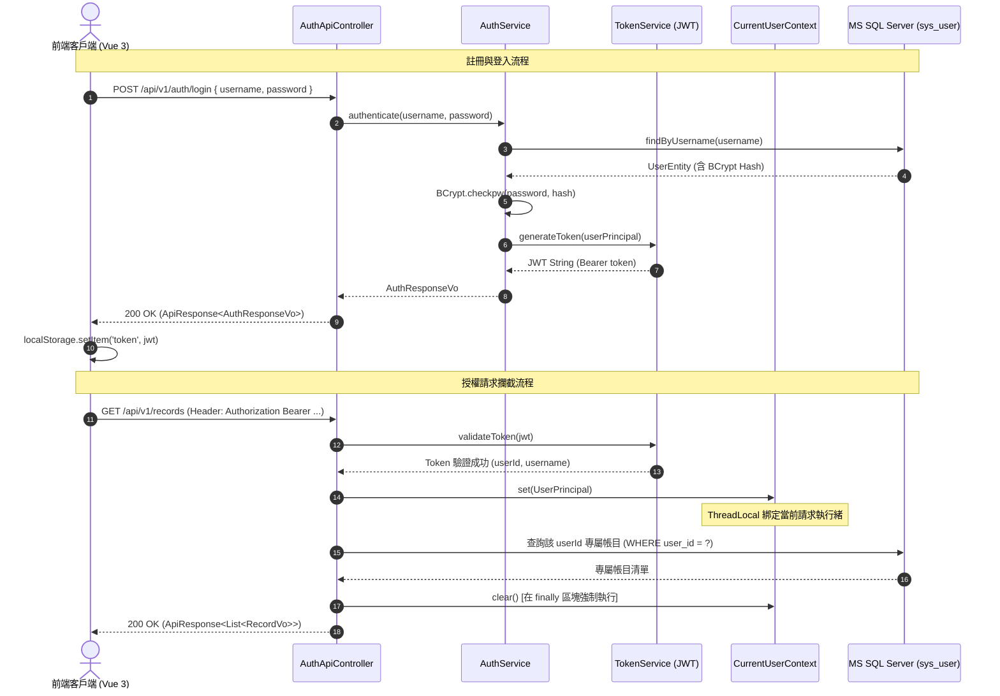
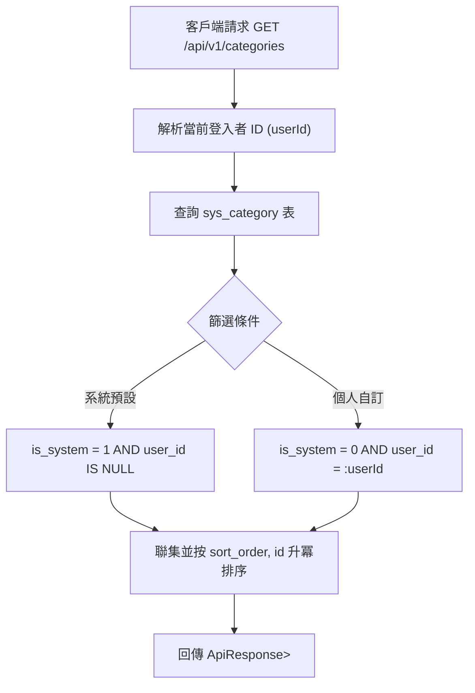
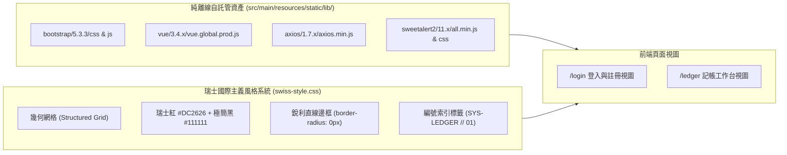

# 2. 功能規格契約與情境矩陣 (Specifications Matrix)

> **專案代號**：`daily-ledger-system`  
> **所屬模組**：系統對外規格契約與場景矩陣  
> **相關基準**：[OpenSpec Specs](file:///c:/Arvin/COURSE/TibMe緯育/JAVA%20金融微服務/Project3/openspec/changes/daily-ledger-system/specs)

規格契約定義系統對外公開行為，杜絕內部實作細節污染，並具備完整之驗收場景 (Scenarios)。

---

## 1. 使用者認證模組 (`user-authentication`)

### 核心規格規範
1. `POST /api/v1/auth/register`：密碼必須以 BCrypt 演算法加密存入 `sys_user`，帳號重複時回傳 `409 Conflict`。
2. `POST /api/v1/auth/login`：驗證成功回傳 JWT Token 與過期時間戳；驗證失敗回傳 `401 Unauthorized`。
3. `GET /api/v1/auth/me`：攜帶有效 Bearer Token 時回傳當前使用者個人資訊，無效時拒絕存取。

---

## 2. 分類管理模組 (`category-management`)

### 核心規格規範
1. **雙層查詢**：自動合併系統內建分類與個人自訂分類。
2. **自訂新增**：建立自訂分類時強制綁定 `user_id = current_user_id` 且 `is_system = 0`。
3. **刪除防呆**：若該自訂分類已存在關聯之 `account_record`，拒絕刪除並回傳衝突錯誤；禁止刪除 `is_system = 1` 之內建分類。

---

## 3. 日常流水帳核心模組 (`daily-ledger`)

### 核心規格規範
1. **中央快速記帳 (Option A 結構化輸入)**：
   - 支援一鍵切換 `EXPENSE (支出)` / `INCOME (收入)`。
   - 金額輸入驗證必須為正數 (`amount > 0`)，精度至小數點後兩位。
   - 輸入完畢按 `Enter` 鍵即可瞬間完成記帳並更新下方數據。
2. **即時月度彙總 (`/api/v1/records/summary`)**：
   - 自動計算指定月份（預設當月）之 `總支出 (Total Expense)`、`總收入 (Total Income)` 與 `淨結餘 (Net Balance)`。
3. **多維度搜尋與隔離**：
   - 支援 `keyword`（備註關鍵字）、`categoryId`（分類）、`recordType`（收支）、`startDate ~ endDate`（日期區間）與分頁查詢。
   - 所有 SQL 查詢均強制附加 `user_id = :currentUserId`，杜絕跨使用者越權存取。

---

## 4. 離線瑞士風格前端 (`offline-web-ui`)

### 核心規格規範
1. **Strict No-CDN**：所有 JS/CSS 資源一律由本機端託管，在無外網（Air-Gapped）環境下 100% 正常載入。
2. **瑞士極簡美學**：直角銳利邊框 (`border-radius: 0px`)、無模糊擴散陰影、高對比無襯線字體、清晰編號索引。
3. **Axios 統一攔截**：請求攔截器自動附帶 `Authorization: Bearer <Token>`；回應攔截器遇 `401` 自動清除本地憑證並導向登入頁。
