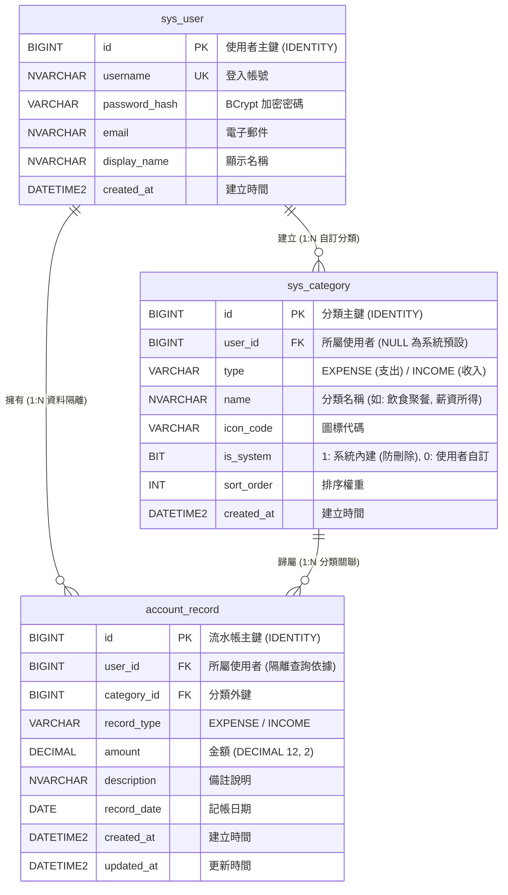

# 4. 資料庫設計與 DDL 腳本 (Database Design & DDL)

> **專案代號**：`daily-ledger-system`  
> **所屬模組**：資料庫實體模型與 DDL/Seed 腳本  
> **資料庫類型**：MS SQL Server (`tibame_account`)

---

## 1. 資料庫實體關聯圖 (MS SQL Server ERD)



---

## 2. 資料庫 DDL 與預設分類種子資料腳本

```sql
-- 1. 使用者表 (sys_user)
CREATE TABLE sys_user (
    id BIGINT IDENTITY(1,1) PRIMARY KEY,
    username NVARCHAR(50) NOT NULL UNIQUE,
    password_hash VARCHAR(100) NOT NULL,
    email NVARCHAR(100) NOT NULL,
    display_name NVARCHAR(50) NULL,
    created_at DATETIME2 NOT NULL DEFAULT GETDATE()
);

-- 2. 分類表 (sys_category)
CREATE TABLE sys_category (
    id BIGINT IDENTITY(1,1) PRIMARY KEY,
    user_id BIGINT NULL,
    type VARCHAR(10) NOT NULL, -- EXPENSE / INCOME
    name NVARCHAR(50) NOT NULL,
    icon_code VARCHAR(30) NULL,
    is_system BIT NOT NULL DEFAULT 0,
    sort_order INT NOT NULL DEFAULT 0,
    created_at DATETIME2 NOT NULL DEFAULT GETDATE(),
    CONSTRAINT FK_category_user FOREIGN KEY (user_id) REFERENCES sys_user(id)
);

-- 3. 流水帳表記錄 (account_record)
CREATE TABLE account_record (
    id BIGINT IDENTITY(1,1) PRIMARY KEY,
    user_id BIGINT NOT NULL,
    category_id BIGINT NOT NULL,
    record_type VARCHAR(10) NOT NULL, -- EXPENSE / INCOME
    amount DECIMAL(12, 2) NOT NULL,
    description NVARCHAR(200) NULL,
    record_date DATE NOT NULL,
    created_at DATETIME2 NOT NULL DEFAULT GETDATE(),
    updated_at DATETIME2 NULL,
    CONSTRAINT FK_record_user FOREIGN KEY (user_id) REFERENCES sys_user(id),
    CONSTRAINT FK_record_category FOREIGN KEY (category_id) REFERENCES sys_category(id)
);

-- 4. 系統預設種子資料
INSERT INTO sys_category (user_id, type, name, is_system, sort_order) VALUES
(NULL, 'EXPENSE', N'飲食聚餐', 1, 10),
(NULL, 'EXPENSE', N'交通出行', 1, 20),
(NULL, 'EXPENSE', N'日常用品', 1, 30),
(NULL, 'EXPENSE', N'居住水電', 1, 40),
(NULL, 'EXPENSE', N'休閒娛樂', 1, 50),
(NULL, 'EXPENSE', N'醫療保健', 1, 60),
(NULL, 'EXPENSE', N'其他支出', 1, 99),
(NULL, 'INCOME',  N'薪資所得', 1, 10),
(NULL, 'INCOME',  N'兼職副業', 1, 20),
(NULL, 'INCOME',  N'投資理財', 1, 30),
(NULL, 'INCOME',  N'其他收入', 1, 99);
```
