# 5. 任務分解與實施計畫 (Tasks Breakdown & Implementation Plan)

> **專案代號**：`daily-ledger-system`  
> **所屬模組**：開發階段任務拆解與甘特圖  
> **相關基準**：[OpenSpec Tasks](file:///c:/Arvin/COURSE/TibMe緯育/JAVA%20金融微服務/Project3/openspec/changes/daily-ledger-system/tasks.md)

整體開發任務嚴格劃分為 7 大模組、共 16 項具備可驗證性 (Verifiable) 的工程任務：

---

## 1. 實作甘特圖 (Gantt Chart)

```mermaid
gantt
    title 日常流水帳系統實作甘特圖
    dateFormat  X
    axisFormat %d

    section 1. 資料庫與基礎配置
    1.1 資料庫 DDL 與 Seed 腳本建立       :active, t1_1, 0, 1
    1.2 Spring Boot 與 MS SQL 連線設定    :active, t1_2, 1, 2

    section 2. 共通基礎與安全架構
    2.1 統一 ApiResponse 與全域例外處理  :t2_1, 2, 3
    2.2 TokenService 與 JWT 簽發驗證     :t2_2, 3, 4
    2.3 UserContext 與 JwtFilter 攔截     :t2_3, 4, 5

    section 3. 實體與數據訪問層
    3.1 User 實體與 UserRepository       :t3_1, 5, 6
    3.2 Category 實體與 CategoryRepo     :t3_2, 6, 7
    3.3 Record 實體與 AccountRecordRepo   :t3_3, 7, 8

    section 4. 業務邏輯與 API 控制器
    4.1 AuthService 與 AuthApiController :t4_1, 8, 9
    4.2 CategoryService 與 API 控制器    :t4_2, 9, 10
    4.3 SmartParserService 擴展介面       :t4_3, 10, 11
    4.4 LedgerService 與 RecordAPI 控制器:t4_4, 11, 12

    section 5. 離線資產與瑞士風格
    5.1 靜態資產離線託管包 (No-CDN)      :t5_1, 12, 13
    5.2 瑞士設計風格 CSS 系統            :t5_2, 13, 14

    section 6. 前端頁面與 MVVM 整合
    6.1 Thymeleaf 頁面路由與模板佈局     :t6_1, 14, 15
    6.2 Vue 3 認證應用與 Axios 攔截器    :t6_2, 15, 16
    6.3 中央 Google-style 快速記帳列     :t6_3, 16, 17
    6.4 月度統計卡片與歷史流水帳表格     :t6_4, 17, 18
    6.5 自訂分類管理視窗元件             :t6_5, 18, 19

    section 7. 端到端驗證與品質驗收
    7.1 完整使用流程 E2E 驗證            :t7_1, 19, 20
    7.2 離線網路與瑞士風格 DoD 稽核      :t7_2, 20, 21
```

---

## 2. 完整任務清單明細 (Task Details)

| 編號 | 任務標題 | 實作內容與驗證標準 (DoD) |
| :--- | :--- | :--- |
| **1.1** | 資料庫 DDL 與 Seed 建立 | 建立 `schema.sql` 與 `data.sql`，執行並驗證 `sys_user`、`sys_category`、`account_record` 表與 11 筆預設分類正確建立。 |
| **1.2** | 資料庫連線配置 | 配置 `application.properties` 連線至 MS SQL Server `localhost:1433` (`tibame_account`)，啟動驗證連線成功。 |
| **2.1** | 統一回應與全域例外 | 實作 `ApiResponse<T>`、自訂例外與 `@RestControllerAdvice GlobalExceptionHandler`，驗證標準錯誤 JSON 回傳。 |
| **2.2** | JWT Token 服務 | 實作 `TokenService` 介面與 `JwtTokenServiceImpl`，編寫單元測試驗證簽發、解析與過期機制。 |
| **2.3** | 使用者上下文與安全 Filter | 實作 `UserPrincipal`、`CurrentUserContext` (ThreadLocal) 與 `JwtAuthenticationFilter`，確保 `finally` 區塊呼叫 `clear()`。 |
| **3.1** | User JPA 實體與 Repository | 實作 `User` 實體與 `UserRepository`，提供 `findByUsername` 與帳號重複檢查。 |
| **3.2** | Category JPA 實體與 Repository | 實作 `Category` 實體與 `CategoryRepository`，提供系統共用與使用者自訂分類之聯集查詢。 |
| **3.3** | Record JPA 實體與 Repository | 實作 `AccountRecord` 與 `AccountRecordRepository`，提供使用者隔離分頁、多條件過濾與月度彙總 Sum 查詢。 |
| **4.1** | 認證服務與 Web API | 實作 `AuthService` 與 `AuthApiController` (`/register`, `/login`, `/me`)，驗證 BCrypt 密碼比對與 Token 回傳。 |
| **4.2** | 分類服務與 Web API | 實作 `CategoryService` 與 `CategoryApiController` (CRUD)，實作系統預設保護與關聯資料刪除防呆。 |
| **4.3** | 智慧解析介面擴展 | 實作 `SmartParserService` 介面與 `RegexSmartParserServiceImpl` 基礎 Stub，建立自然語言記帳之擴展點。 |
| **4.4** | 記帳服務與 Web API | 實作 `LedgerService` 與 `RecordApiController` (`/records/*`、`/summary`)，驗證嚴格之 `user_id` 數據隔離。 |
| **5.1** | 離線資產包配置 | 下載 Bootstrap 5.3.3、Vue 3.4.x、Axios 1.7.x、SweetAlert2 11.x 至 `static/lib/`，確認 0 外部 CDN 請求。 |
| **5.2** | 瑞士風格 CSS 系統 | 建立 `swiss-style.css`，配置幾何網格、`#DC2626` 瑞士紅、`0px` 直角邊框與編號索引標籤 (`SYS-LEDGER // 01`)。 |
| **6.1** | Thymeleaf 視圖控制器 | 實作 `ViewController` 渲染 `/login` 與 `/ledger` HTML 模板，完成版面基礎載入。 |
| **6.2** | Vue 3 認證與 Axios 攔截 | 實作 Vue 3 登入/註冊表單、Axios 請求 Token 注入與 401 攔截跳轉。 |
| **6.3** | Google 搜尋列快速記帳 | 實作中央焦點輸入列 (收支切換、金額、分類、備註、Enter 記帳) 與 SweetAlert2 幾何 Toast 回饋。 |
| **6.4** | 統計卡片與歷史流水列表 | 實作當月即時統計卡片 (總收、總支、結餘) 與具備搜尋、篩選、分頁、修改、刪除確認之資料表格。 |
| **6.5** | 自訂分類管理互動視窗 | 實作分類彈窗介面，支援查看系統預設分類與新增/刪除個人自訂分類。 |
| **7.1** | 端到端完整流程驗收 | 執行完整業務旅程：註冊 ➔ 登入 ➔ 快速記帳 ➔ 自訂分類 ➔ 月度統計 ➔ 篩選搜尋 ➔ 編輯刪除。 |
| **7.2** | 離線與瑞士風格 DoD 稽核 | 於離線 (Air-Gapped) 環境與不同解析度下進行稽核，確認符合所有交付定義。 |
