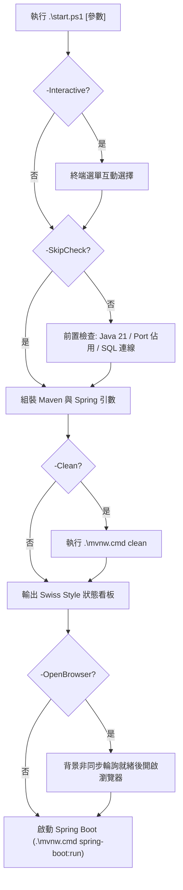

# 07. PowerShell 啟動腳本與維運指南 (Startup Script & DevOps Guide)

本文件為「日常流水帳系統 (`daily-ledger-system`)」本機一鍵啟動腳本 `start.ps1` 的技術規格與操作指南。

---

## 1. 執行目標與設計哲學

- **零配置開箱即用**：預設以 H2 記憶體資料庫啟動，無須依賴外在環境即可測試完整功能。
- **雙資料庫支援**：提供 `-Profile mssql` 旗標直接無縫銜接本機 MS SQL Server。
- **智慧前置診斷**：自動探測 Java 21+、Port 8080 衝突診斷（提示佔用 PID）、SQL Server 1433 連線狀態。
- **自動化體驗**：支援就緒自動開啟瀏覽器、遠端除錯（Port 5005）、互動式選單及任意參數透傳。

---

## 2. 執行架構圖



---

## 3. 完整參數速查

| 參數 | 別名 | 預設值 | 說明 |
| :--- | :--- | :--- | :--- |
| `-Profile` | `-p`, `-Mode` | `'h2'` | 運作環境 (`h2` / `mssql` / `prod`) |
| `-Port` | `-serverPort`, `-httpPort` | `8080` | 指定 HTTP Port |
| `-Clean` | `-c` | `$false` | 啟動前先執行 `mvn clean` |
| `-DebugMode` | `-d` | `$false` | 開啟 JVM Remote Debugger (Port 5005) |
| `-OpenBrowser` | `-b` | `$false` | 服務啟動後自動在預設瀏覽器開啟網頁 |
| `-Interactive` | `-i` | `$false` | 進入互動式數字選單 |
| `-SkipCheck` |  | `$false` | 略過所有前置環境檢查 |
| `$ExtraArgs` |  | `$null` | 透傳參數至 Maven / Spring Boot |

---

## 4. 常用範例

```powershell
# 1. 預設啟動 (H2 模式, 8080)
.\start.ps1

# 2. MS SQL 模式
.\start.ps1 -p mssql

# 3. 指定 Port 並自動開啟瀏覽器
.\start.ps1 -Port 9090 -b

# 4. 互動式選單模式
.\start.ps1 -i
```
