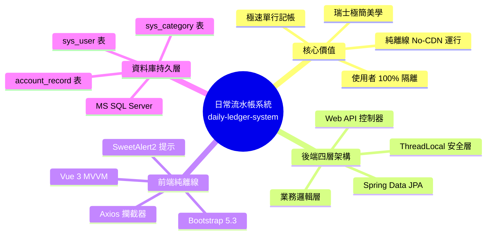
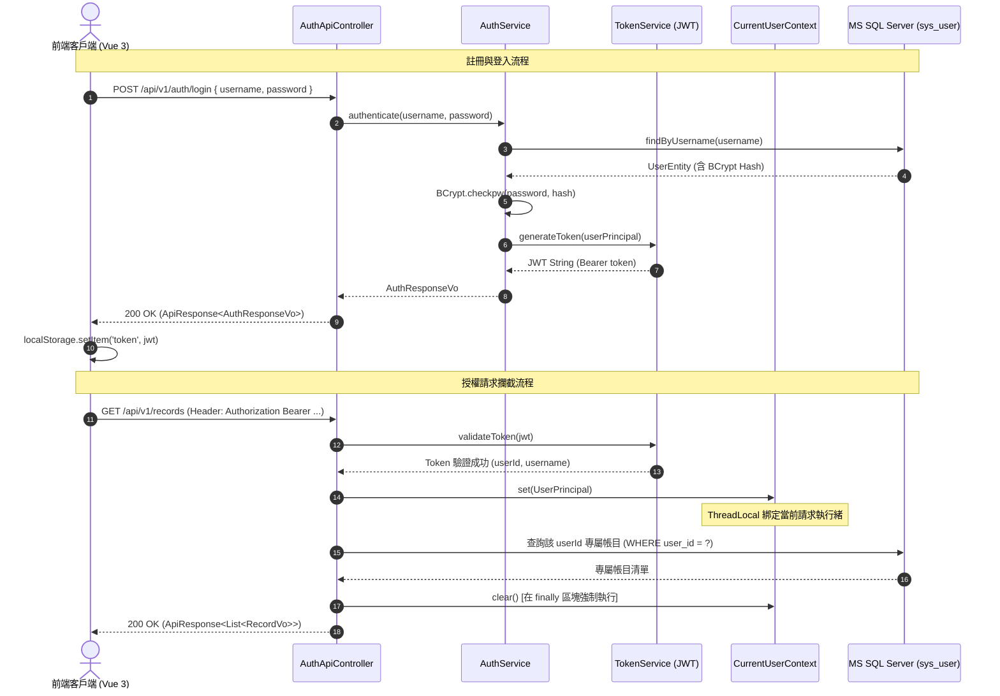
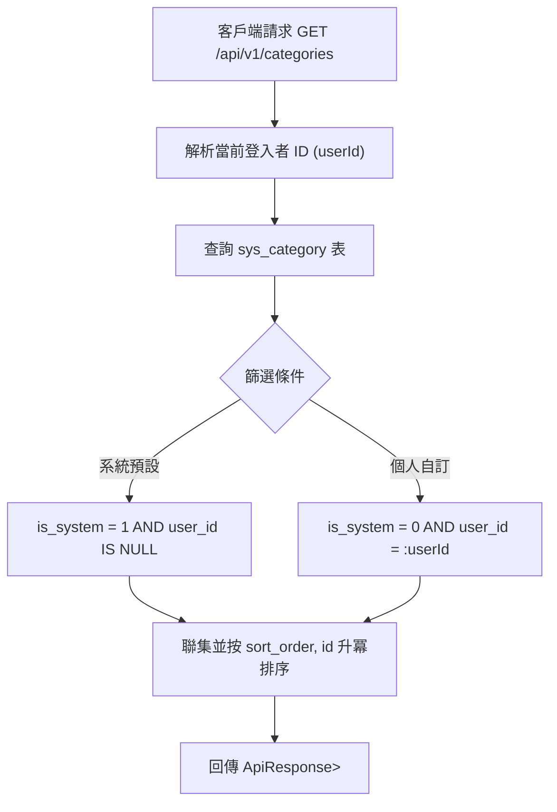
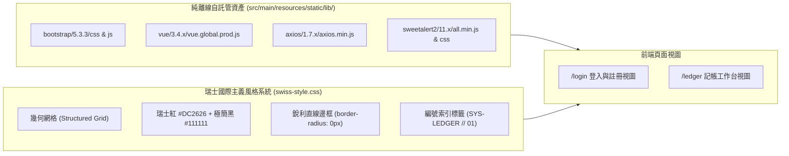
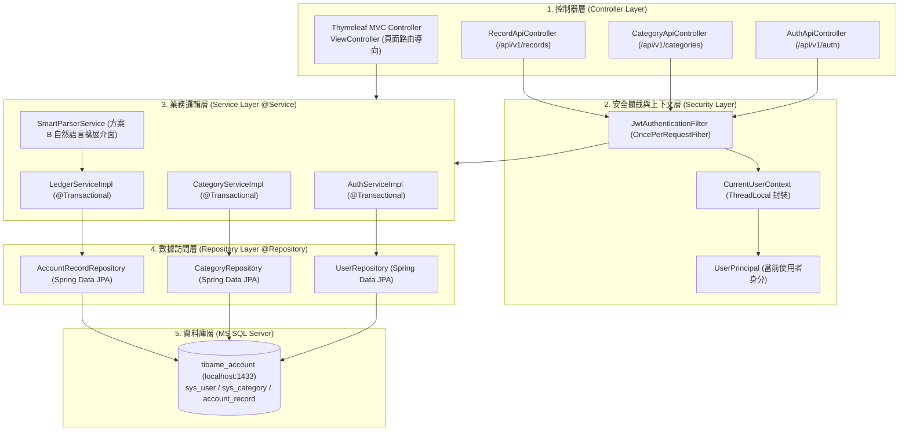
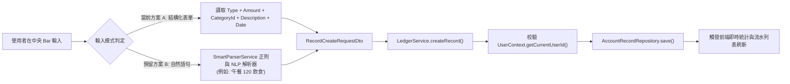
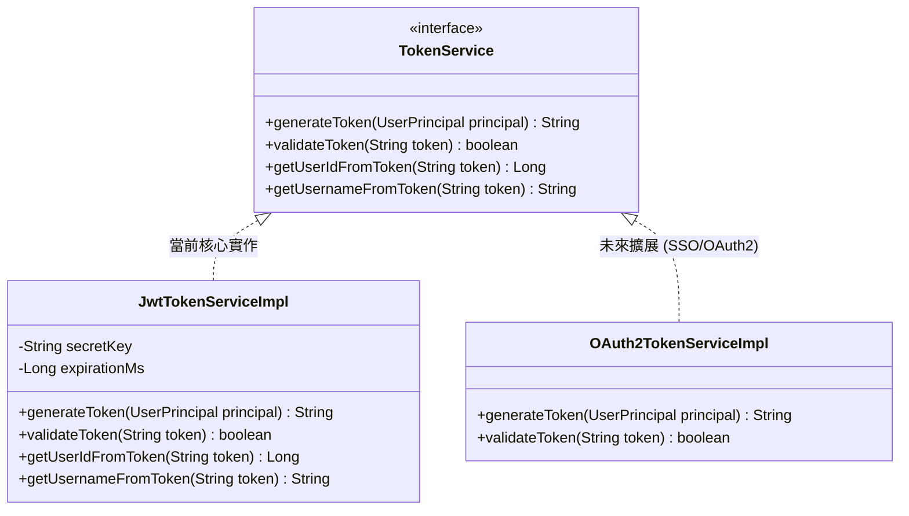
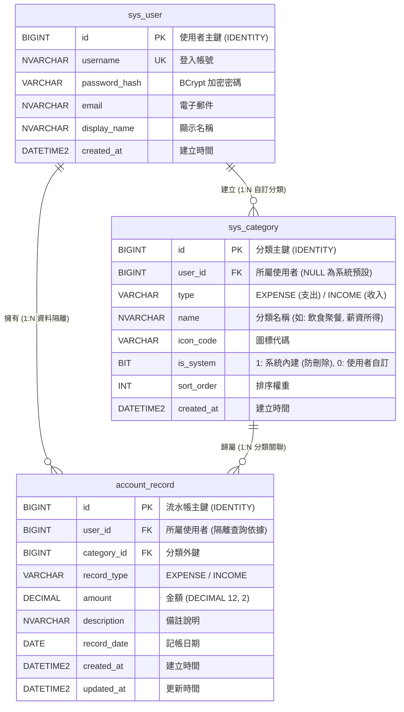

# 日常流水帳系統 (Daily Ledger System) — 提案、規格、設計與任務全方位實施報告

> **專案代號**：`daily-ledger-system`  
> **基準變更**：`openspec/changes/daily-ledger-system`  
> **技術棧**：Spring Boot 3.x ➔ Spring Data JPA ➔ MS SQL Server ➔ Thymeleaf ➔ Vue 3 MVVM (No-CDN Offline) ➔ Swiss Style Design  
> **報告日期**：2026-09-01  
> **狀態**：規劃產物完整審查通過 (`Planning Complete`, `Strict Validated`)

---

## 1. 執行摘要 (Executive Summary)

本報告針對「日常流水帳系統 (`daily-ledger-system`)」自**需求提案 (Proposal)**、**功能規格契約 (Specifications)**、**技術架構設計 (Design)** 到**任務拆解執行清單 (Tasks)** 進行全方位整合與視覺化解說。

系統旨在解決個人記帳操作繁瑣、介面壅塞與過度依賴外網 CDN 的問題。透過打造**類 Google 搜尋框之中央極速記帳工作台**、落實**使用者資料 100% 獨立隔離**與**無狀態 JWT 認證**，並結合**純離線 (Strict No-CDN) 瑞士國際主義風格 (Swiss Design Style)** 視覺系統，建構一套極簡、俐落、高效且可擴展的記帳微服務。

---

## 2. 提案總覽 (Proposal: Why & What Changes)



### 2.1 為什麼需要此變更 (Why)
現行記帳軟體常受限於繁瑣的多層跳轉表單，或重度依賴第三方雲端與外部 CDN，造成網路受限環境下無法穩定運行。本專案以 Spring Boot 3.x 為骨幹，提供嚴格的四層架構與 MS SQL Server 資料持久化，前端採用純離線自託管架構，結合瑞士紅 (`#DC2626`) 與網格幾何排版，實現極致俐落的高效記帳體驗。

### 2.2 變更範圍與四大能力 (Capabilities)

| 能力代號 (Capability) | 類型 | 涵蓋範疇與交付目標 |
| :--- | :--- | :--- |
| **`user-authentication`** | 新增 (New) | 使用者註冊、BCrypt 密碼雜湊、JWT Token 簽發/校驗、ThreadLocal 使用者上下文隔離。 |
| **`category-management`** | 新增 (New) | 雙層分類體系（系統內建預設共用 + 使用者自訂專屬分類）之查詢、新增、修改與關聯防呆刪除。 |
| **`daily-ledger`** | 新增 (New) | 流水帳 CRUD、多維度組合搜尋（關鍵字/日期/收支/分類）、分頁查詢與本月即時收支結餘彙總計算。 |
| **`offline-web-ui`** | 新增 (New) | 純離線靜態資產架構、瑞士風格主題樣式、中央搜尋框記帳工作台、即時統計卡片與自訂分類視窗。 |

---

## 3. 功能規格契約與情境矩陣 (Specifications Matrix)

規格契約定義系統對外公開行為，杜絕內部實作細節污染，並具備完整之驗收場景 (Scenarios)。

### 3.1 使用者認證模組 (`user-authentication`)



- **核心規格規範**：
  1. `POST /api/v1/auth/register`：密碼必須以 BCrypt 演算法加密存入 `sys_user`，帳號重複時回傳 `409 Conflict`。
  2. `POST /api/v1/auth/login`：驗證成功回傳 JWT Token 與過期時間戳；驗證失敗回傳 `401 Unauthorized`。
  3. `GET /api/v1/auth/me`：攜帶有效 Bearer Token 時回傳當前使用者個人資訊，無效時拒絕存取。

---

### 3.2 分類管理模組 (`category-management`)



- **核心規格規範**：
  1. **雙層查詢**：自動合併系統內建分類與個人自訂分類。
  2. **自訂新增**：建立自訂分類時強制綁定 `user_id = current_user_id` 且 `is_system = 0`。
  3. **刪除防呆**：若該自訂分類已存在關聯之 `account_record`，拒絕刪除並回傳衝突錯誤；禁止刪除 `is_system = 1` 之內建分類。

---

### 3.3 日常流水帳核心模組 (`daily-ledger`)

- **中央快速記帳 (Option A 結構化輸入)**：
  - 支援一鍵切換 `EXPENSE (支出)` / `INCOME (收入)`。
  - 金額輸入驗證必須為正數 (`amount > 0`)，精度至小數點後兩位。
  - 輸入完畢按 `Enter` 鍵即可瞬間完成記帳並更新下方數據。
- **即時月度彙總 (`/api/v1/records/summary`)**：
  - 自動計算指定月份（預設當月）之 `總支出 (Total Expense)`、`總收入 (Total Income)` 與 `淨結餘 (Net Balance)`。
- **多維度搜尋與隔離**：
  - 支援 `keyword`（備註關鍵字）、`categoryId`（分類）、`recordType`（收支）、`startDate ~ endDate`（日期區間）與分頁查詢。
  - 所有 SQL 查詢均強制附加 `user_id = :currentUserId`，杜絕跨使用者越權存取。

---

### 3.4 離線瑞士風格前端 (`offline-web-ui`)



- **核心規格規範**：
  1. **Strict No-CDN**：所有 JS/CSS 資源一律由本機端託管，在無外網（Air-Gapped）環境下 100% 正常載入。
  2. **瑞士極簡美學**：直角銳利邊框 (`border-radius: 0px`)、無模糊擴散陰影、高對比無襯線字體、清晰編號索引。
  3. **Axios 統一攔截**：請求攔截器自動附帶 `Authorization: Bearer <Token>`；回應攔截器遇 `401` 自動清除本地憑證並導向登入頁。

---

## 4. 系統技術架構與設計 (Architecture & Technical Design)

### 4.1 系統總體四層分層架構



---

### 4.2 輸入擴展架構：方案 A (結構化) 與 方案 B (自然語言)



---

### 4.3 可插拔 Token 服務類別設計



---

### 4.4 資料庫實體關聯圖 (MS SQL Server ERD)



#### 資料庫 DDL 與預設分類腳本

```sql
-- 1. 使用者表
CREATE TABLE sys_user (
    id BIGINT IDENTITY(1,1) PRIMARY KEY,
    username NVARCHAR(50) NOT NULL UNIQUE,
    password_hash VARCHAR(100) NOT NULL,
    email NVARCHAR(100) NOT NULL,
    display_name NVARCHAR(50) NULL,
    created_at DATETIME2 NOT NULL DEFAULT GETDATE()
);

-- 2. 分類表
CREATE TABLE sys_category (
    id BIGINT IDENTITY(1,1) PRIMARY KEY,
    user_id BIGINT NULL,
    type VARCHAR(10) NOT NULL, -- EXPENSE / INCOME
    name NVARCHAR(50) NOT NULL,
    icon_code VARCHAR(30) NULL,
    is_system BIT NOT NULL DEFAULT 0,
    sort_order INT NOT NULL DEFAULT 0,
    created_at DATETIME2 NOT NULL DEFAULT GETDATE(),
    CONSTRAINT FK_category_user FOREIGN KEY (user_id) REFERENCES sys_user(id)
);

-- 3. 流水帳表記錄
CREATE TABLE account_record (
    id BIGINT IDENTITY(1,1) PRIMARY KEY,
    user_id BIGINT NOT NULL,
    category_id BIGINT NOT NULL,
    record_type VARCHAR(10) NOT NULL, -- EXPENSE / INCOME
    amount DECIMAL(12, 2) NOT NULL,
    description NVARCHAR(200) NULL,
    record_date DATE NOT NULL,
    created_at DATETIME2 NOT NULL DEFAULT GETDATE(),
    updated_at DATETIME2 NULL,
    CONSTRAINT FK_record_user FOREIGN KEY (user_id) REFERENCES sys_user(id),
    CONSTRAINT FK_record_category FOREIGN KEY (category_id) REFERENCES sys_category(id)
);

-- 4. 系統預設種子資料
INSERT INTO sys_category (user_id, type, name, is_system, sort_order) VALUES
(NULL, 'EXPENSE', N'飲食聚餐', 1, 10),
(NULL, 'EXPENSE', N'交通出行', 1, 20),
(NULL, 'EXPENSE', N'日常用品', 1, 30),
(NULL, 'EXPENSE', N'居住水電', 1, 40),
(NULL, 'EXPENSE', N'休閒娛樂', 1, 50),
(NULL, 'EXPENSE', N'醫療保健', 1, 60),
(NULL, 'EXPENSE', N'其他支出', 1, 99),
(NULL, 'INCOME',  N'薪資所得', 1, 10),
(NULL, 'INCOME',  N'兼職副業', 1, 20),
(NULL, 'INCOME',  N'投資理財', 1, 30),
(NULL, 'INCOME',  N'其他收入', 1, 99);
```

---

## 5. 任務分解與實作執行清單 (Tasks Breakdown)

整體開發任務嚴格劃分為 7 大模組、共 16 項具備可驗證性 (Verifiable) 的工程任務：

```mermaid
gantt
    title 日常流水帳系統實作甘特圖
    dateFormat  X
    axisFormat %d

    section 1. 資料庫與基礎配置
    1.1 資料庫 DDL 與 Seed 腳本建立       :active, t1_1, 0, 1
    1.2 Spring Boot 與 MS SQL 連線設定    :active, t1_2, 1, 2

    section 2. 共通基礎與安全架構
    2.1 統一 ApiResponse 與全域例外處理  :t2_1, 2, 3
    2.2 TokenService 與 JWT 簽發驗證     :t2_2, 3, 4
    2.3 UserContext 與 JwtFilter 攔截     :t2_3, 4, 5

    section 3. 實體與數據訪問層
    3.1 User 實體與 UserRepository       :t3_1, 5, 6
    3.2 Category 實體與 CategoryRepo     :t3_2, 6, 7
    3.3 Record 實體與 AccountRecordRepo   :t3_3, 7, 8

    section 4. 業務邏輯與 API 控制器
    4.1 AuthService 與 AuthApiController :t4_1, 8, 9
    4.2 CategoryService 與 API 控制器    :t4_2, 9, 10
    4.3 SmartParserService 擴展介面       :t4_3, 10, 11
    4.4 LedgerService 與 RecordAPI 控制器:t4_4, 11, 12

    section 5. 離線資產與瑞士風格
    5.1 靜態資產離線託管包 (No-CDN)      :t5_1, 12, 13
    5.2 瑞士設計風格 CSS 系統            :t5_2, 13, 14

    section 6. 前端頁面與 MVVM 整合
    6.1 Thymeleaf 頁面路由與模板佈局     :t6_1, 14, 15
    6.2 Vue 3 認證應用與 Axios 攔截器    :t6_2, 15, 16
    6.3 中央 Google-style 快速記帳列     :t6_3, 16, 17
    6.4 月度統計卡片與歷史流水帳表格     :t6_4, 17, 18
    6.5 自訂分類管理視窗元件             :t6_5, 18, 19

    section 7. 端到端驗證與品質驗收
    7.1 完整使用流程 E2E 驗證            :t7_1, 19, 20
    7.2 離線網路與瑞士風格 DoD 稽核      :t7_2, 20, 21
```



### 完整任務清單明細：

| 編號 | 任務標題 | 實作內容與驗證標準 (DoD) |
| :--- | :--- | :--- |
| **1.1** | 資料庫 DDL 與 Seed 建立 | 建立 `schema.sql` 與 `data.sql`，執行並驗證 `sys_user`、`sys_category`、`account_record` 表與 11 筆預設分類正確建立。 |
| **1.2** | 資料庫連線配置 | 配置 `application.properties` 連線至 MS SQL Server `localhost:1433` (`tibame_account`)，啟動驗證連線成功。 |
| **2.1** | 統一回應與全域例外 | 實作 `ApiResponse<T>`、自訂例外與 `@RestControllerAdvice GlobalExceptionHandler`，驗證標準錯誤 JSON 回傳。 |
| **2.2** | JWT Token 服務 | 實作 `TokenService` 介面與 `JwtTokenServiceImpl`，編寫單元測試驗證簽發、解析與過期機制。 |
| **2.3** | 使用者上下文與安全 Filter | 實作 `UserPrincipal`、`CurrentUserContext` (ThreadLocal) 與 `JwtAuthenticationFilter`，確保 `finally` 區塊呼叫 `clear()`。 |
| **3.1** | User JPA 實體與 Repository | 實作 `User` 實體與 `UserRepository`，提供 `findByUsername` 與帳號重複檢查。 |
| **3.2** | Category JPA 實體與 Repository | 實作 `Category` 實體與 `CategoryRepository`，提供系統共用與使用者自訂分類之聯集查詢。 |
| **3.3** | Record JPA 實體與 Repository | 實作 `AccountRecord` 與 `AccountRecordRepository`，提供使用者隔離分頁、多條件過濾與月度彙總 Sum 查詢。 |
| **4.1** | 認證服務與 Web API | 實作 `AuthService` 與 `AuthApiController` (`/register`, `/login`, `/me`)，驗證 BCrypt 密碼比對與 Token 回傳。 |
| **4.2** | 分類服務與 Web API | 實作 `CategoryService` 與 `CategoryApiController` (CRUD)，實作系統預設保護與關聯資料刪除防呆。 |
| **4.3** | 智慧解析介面擴展 | 實作 `SmartParserService` 介面與 `RegexSmartParserServiceImpl` 基礎 Stub，建立自然語言記帳之擴展點。 |
| **4.4** | 記帳服務與 Web API | 實作 `LedgerService` 與 `RecordApiController` (`/records/*`、`/summary`)，驗證嚴格之 `user_id` 數據隔離。 |
| **5.1** | 離線資產包配置 | 下載 Bootstrap 5.3.3、Vue 3.4.x、Axios 1.7.x、SweetAlert2 11.x 至 `static/lib/`，確認 0 外部 CDN 請求。 |
| **5.2** | 瑞士風格 CSS 系統 | 建立 `swiss-style.css`，配置幾何網格、`#DC2626` 瑞士紅、`0px` 直角邊框與編號索引標籤 (`SYS-LEDGER // 01`)。 |
| **6.1** | Thymeleaf 視圖控制器 | 實作 `ViewController` 渲染 `/login` 與 `/ledger` HTML 模板，完成版面基礎載入。 |
| **6.2** | Vue 3 認證與 Axios 攔截 | 實作 Vue 3 登入/註冊表單、Axios 請求 Token 注入與 401 攔截跳轉。 |
| **6.3** | Google 搜尋列快速記帳 | 實作中央焦點輸入列 (收支切換、金額、分類、備註、Enter 記帳) 與 SweetAlert2 幾何 Toast 回饋。 |
| **6.4** | 統計卡片與歷史流水列表 | 實作當月即時統計卡片 (總收、總支、結餘) 與具備搜尋、篩選、分頁、修改、刪除確認之資料表格。 |
| **6.5** | 自訂分類管理互動視窗 | 實作分類彈窗介面，支援查看系統預設分類與新增/刪除個人自訂分類。 |
| **7.1** | 端到端完整流程驗收 | 執行完整業務旅程：註冊 ➔ 登入 ➔ 快速記帳 ➔ 自訂分類 ➔ 月度統計 ➔ 篩選搜尋 ➔ 編輯刪除。 |
| **7.2** | 離線與瑞士風格 DoD 稽核 | 於離線 (Air-Gapped) 環境與不同解析度下進行稽核，確認符合所有交付定義。 |

---

## 6. 品質保證與驗收標準 (Definition of Done, DoD)

```mermaid
checklist
    title 交付定義驗收矩陣 (DoD Matrix)
    - [x] 後端四層嚴格解耦 (Controller ➔ Service ➔ Repository ➔ DB)
    - [x] 所有密碼採用 BCrypt 雜湊加密
    - [x] 所有 API 使用統一 ApiResponse 包裝
    - [x] 跨使用者數據 100% 嚴格隔離 (No IDOR)
    - [x] 靜態資產 Strict No-CDN (100% 純離線載入)
    - [x] 視覺設計 100% 遵循瑞士國際主義風格
    - [x] 金額運算一律採用 BigDecimal 防止精度遺失
    - [x] OpenSpec 嚴格模式檢驗通過 (Strict Validated)
```

---

### 總結

本實施報告已完整收斂「日常流水帳系統 (`daily-ledger-system`)」自探索階段至規劃落地之所有細節。所有產物均已存放於 `openspec/changes/daily-ledger-system/`，並通過 OpenSpec 嚴格驗證。當準備進入程式碼開發階段時，可直接透過 `/opsx-apply` 指令驅動實作。
