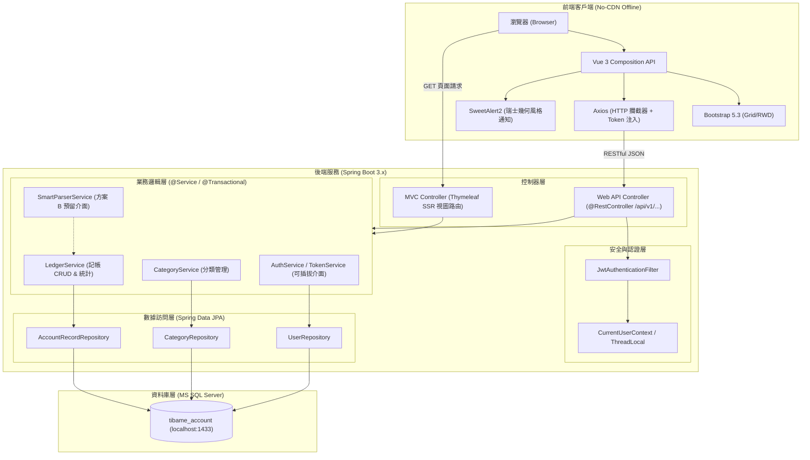
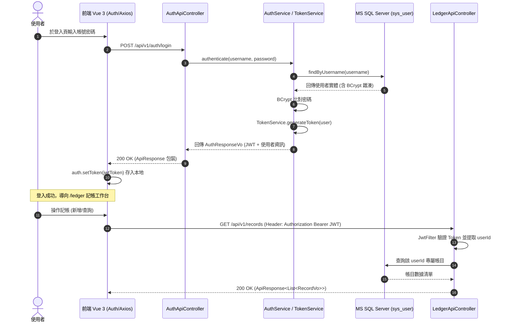
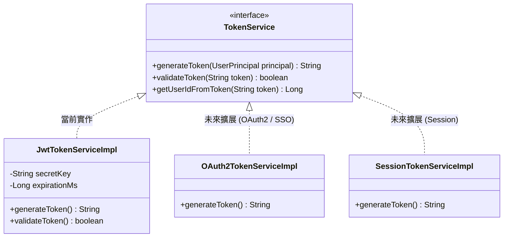
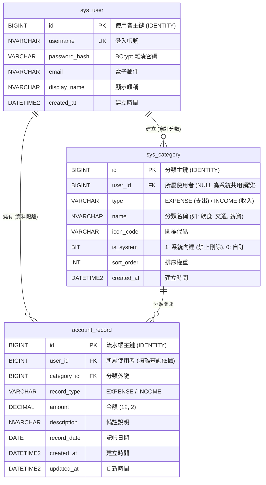

# 日常流水帳系統 (Daily Ledger System) — 系統架構與設計探索報告

> **導覽指引**：[← 返回專案文件總覽門戶 (docs/README.md)](../README.md)  

本文件為「日常流水帳系統」在探索階段（Explore Mode）之完整系統架構、互動設計、資料庫規格與技術落實規劃報告。

---

## 1. 執行摘要 (Executive Summary)

本專案旨在建立一套現代、極簡且高效的**個人日常流水帳管理系統**。系統結合 **Spring Boot 3.x 後端四層架構**、**純離線 (Strict No-CDN) 前端** 與 **瑞士國際主義風格 (Swiss Design Style)** 視覺系統。

- **核心特色**：
  - **類 Google 搜尋框記帳體驗**：首頁工作台以中央焦點列為核心，採用結構化快填（方案 A），並預留未來升級自然語言解析（方案 B）之擴展介面。
  - **雙層分類管理**：提供開箱即用的系統預設分類，並支援使用者個人化自訂分類 CRUD。
  - **安全與隔離**：基於 JWT 無狀態認證，並具備可插拔之安全架構；保證各使用者帳目數據 100% 獨立隔離。
  - **資料庫**：微軟 MS SQL Server（資料庫名稱：`tibame_account`，`localhost:1433`，帳號：`sa`，密碼：`1111`）。

---

## 2. 系統總體架構 (System Architecture)

系統後端採用嚴格四層架構（Controller ➔ Service ➔ Repository ➔ Database），前端採用純離線自託管架構。



---

## 3. JWT 認證與可插拔擴展架構 (Authentication Flow)

系統採用 JWT 作為身分驗證憑證，前端透過 Axios 請求攔截器自動附帶 Token，後端透過統一 Filter 提取並驗證。



### 可擴展性設計 (Extensibility Design)


---

## 4. 類 Google 搜尋框記帳工作台與擴展設計 (Ledger UX)

### (1) 方案 A 介面與方案 B 擴展架構
- **方案 A (當前實施)**：中央搜尋列以直觀的「收支切換 + 金額 + 分類下拉 + 備註 + Enter 記帳」組成，精確無歧義。
- **方案 B (預留擴展)**：支援在同一列輸入自然語句（如 `午餐 120 飲食`），後端調用 `SmartParserService` 自動解析入庫。

```mermaid
flowchart TD
    StartInput["使用者在中央 Bar 輸入"] --> ModeCheck{"輸入模式判定"}
    
    ModeCheck -->|方案 A: 結構化表單| FormSubmit["讀取 Type / Amount / CategoryId / Description"]
    ModeCheck -->|方案 B: 自然語句 (預留)| SmartParse["送至 SmartParserService 解析正則/NLP"]
    
    SmartParse --> ValidateData["轉換為 RecordCreateRequestDto"]
    FormSubmit --> ValidateData
    
    ValidateData --> CheckAuth["校驗當前登入者 ID (UserContext)"]
    CheckAuth --> SaveDB["JPA 寫入 account_record 表"]
    SaveDB --> RefreshList["即時更新下方統計卡片與歷史流水清單"]
    RefreshList --> Toast["SweetAlert2 彈出極簡記帳成功 Toast"]
```

---

## 5. 資料庫實體關聯圖 (MS SQL Server ERD)

資料庫採用 `tibame_account`，並透過外鍵關聯落實資料完整性與使用者隔離。



### 資料庫 DDL 腳本 (MS SQL Server)
```sql
-- 1. 使用者表
CREATE TABLE sys_user (
    id BIGINT IDENTITY(1,1) PRIMARY KEY,
    username NVARCHAR(50) NOT NULL UNIQUE,
    password_hash VARCHAR(100) NOT NULL,
    email NVARCHAR(100) NOT NULL,
    display_name NVARCHAR(50) NULL,
    created_at DATETIME2 NOT NULL DEFAULT GETDATE()
);

-- 2. 分類表 (支援預設與個人自訂)
CREATE TABLE sys_category (
    id BIGINT IDENTITY(1,1) PRIMARY KEY,
    user_id BIGINT NULL,
    type VARCHAR(10) NOT NULL, -- EXPENSE / INCOME
    name NVARCHAR(50) NOT NULL,
    icon_code VARCHAR(30) NULL,
    is_system BIT NOT NULL DEFAULT 0,
    sort_order INT NOT NULL DEFAULT 0,
    created_at DATETIME2 NOT NULL DEFAULT GETDATE(),
    CONSTRAINT FK_category_user FOREIGN KEY (user_id) REFERENCES sys_user(id)
);

-- 3. 流水帳表記錄
CREATE TABLE account_record (
    id BIGINT IDENTITY(1,1) PRIMARY KEY,
    user_id BIGINT NOT NULL,
    category_id BIGINT NOT NULL,
    record_type VARCHAR(10) NOT NULL,
    amount DECIMAL(12, 2) NOT NULL,
    description NVARCHAR(200) NULL,
    record_date DATE NOT NULL,
    created_at DATETIME2 NOT NULL DEFAULT GETDATE(),
    updated_at DATETIME2 NULL,
    CONSTRAINT FK_record_user FOREIGN KEY (user_id) REFERENCES sys_user(id),
    CONSTRAINT FK_record_category FOREIGN KEY (category_id) REFERENCES sys_category(id)
);

-- 4. 系統預設分類種子資料 (Seed Data)
INSERT INTO sys_category (user_id, type, name, is_system, sort_order) VALUES
(NULL, 'EXPENSE', N'飲食聚餐', 1, 10),
(NULL, 'EXPENSE', N'交通出行', 1, 20),
(NULL, 'EXPENSE', N'日常用品', 1, 30),
(NULL, 'EXPENSE', N'居住水電', 1, 40),
(NULL, 'EXPENSE', N'休閒娛樂', 1, 50),
(NULL, 'EXPENSE', N'醫療保健', 1, 60),
(NULL, 'EXPENSE', N'其他支出', 1, 99),
(NULL, 'INCOME',  N'薪資所得', 1, 10),
(NULL, 'INCOME',  N'兼職副業', 1, 20),
(NULL, 'INCOME',  N'投資理財', 1, 30),
(NULL, 'INCOME',  N'其他收入', 1, 99);
```

---

## 6. RESTful Web API 規格定義

所有 API 均以 `/api/v1` 為前綴，並統一封裝於 `ApiResponse<T>` 格式中。

| 模組 | HTTP 方法 | 端點 (Endpoint) | 說明 | 認證要求 |
| :--- | :--- | :--- | :--- | :--- |
| **認證** | `POST` | `/api/v1/auth/register` | 使用者註冊 (帳號、密碼、信箱) | 公開 |
| **認證** | `POST` | `/api/v1/auth/login` | 使用者登入 (回傳 JWT Token) | 公開 |
| **認證** | `GET` | `/api/v1/auth/me` | 獲取當前登入者基本資訊 | Bearer JWT |
| **分類** | `GET` | `/api/v1/categories` | 查詢可用的分類清單 (系統預設 + 當前使用者自訂) | Bearer JWT |
| **分類** | `POST` | `/api/v1/categories` | 新增使用者自訂分類 | Bearer JWT |
| **分類** | `PUT` | `/api/v1/categories/{id}` | 修改自訂分類名稱/圖標 | Bearer JWT |
| **分類** | `DELETE`| `/api/v1/categories/{id}` | 刪除自訂分類 (含關聯檢查) | Bearer JWT |
| **記帳** | `GET` | `/api/v1/records` | 分頁/條件查詢流水帳 (關鍵字、日期區間、分類) | Bearer JWT |
| **記帳** | `GET` | `/api/v1/records/summary` | 獲取本月統計 (總收入、總支出、結餘) | Bearer JWT |
| **記帳** | `POST` | `/api/v1/records` | 新增一筆流水帳 (中央 Bar 提交) | Bearer JWT |
| **記帳** | `PUT` | `/api/v1/records/{id}` | 修改流水帳記錄 | Bearer JWT |
| **記帳** | `DELETE`| `/api/v1/records/{id}` | 刪除流水帳記錄 | Bearer JWT |

---

## 7. 視覺與前端規範落實 (Swiss Style & Offline)

1. **色彩盤**：
   - 核心點綴：經典瑞士紅 `#DC2626`
   - 主色調：純黑 `#111111`、深炭灰 `#262626`、背景畫布 `#F8F9FA`、卡片底色 `#FFFFFF`。
2. **排版與網格**：
   - 無襯線字體層次（Inter / Helvetica / Arial）、編號標籤（如 `SYS-LEDGER // 01`）。
   - 幾何俐落直線（`1px` / `2px` 實線邊框）、直角或微倒角（`border-radius: 0px`）、無模糊發散陰影。
3. **離線依賴 (Strict No-CDN)**：
   - 本地目錄 `src/main/resources/static/lib/` 託管 Bootstrap 5.3.3、Vue 3.4.x、Axios 1.7.x、SweetAlert2 11.x。
