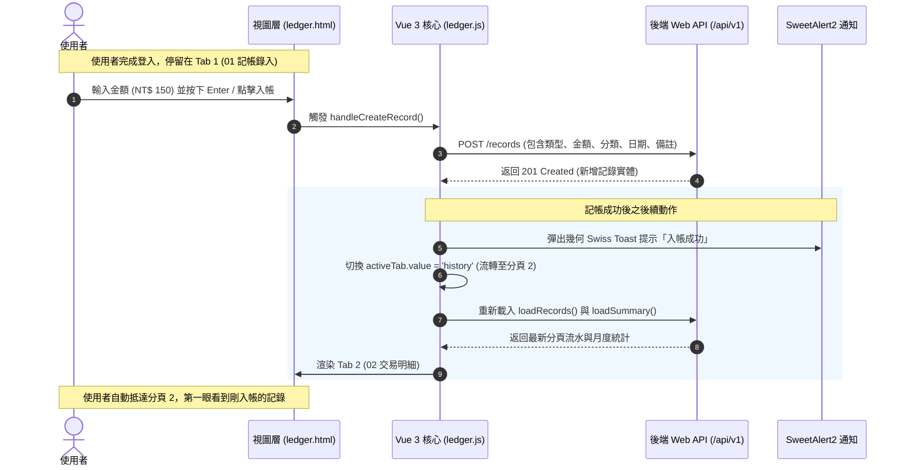

# 日常流水帳系統 (Daily Ledger System) — 分頁化工作台與純粹記帳首頁探索報告

> **導覽指引**：[← 返回專案文件總覽門戶 (docs/README.md)](../README.md)  
> **文件版本**：v1.0.0 (探索成果歸檔版)  
> **產出日期**：2026-09-05  
> **系統名稱**：日常流水帳系統 (Daily Ledger System)  
> **探索主題**：使用者介面分頁化重構 (Tabbed Workbench) 與登入後聚焦記帳首頁 (Focus Entry First)  
> **文件定位**：探索文件軌 (Exploration Track) — 業務場景、視覺原型、操作時序與狀態流轉推演報告  

---

## 報告目錄導覽 (Table of Contents)

1. [執行摘要 (Executive Summary)](#1-執行摘要-executive-summary)
2. [問題背景與現況痛點分析 (Background & Pain Points)](#2-問題背景與現況痛點分析-background--pain-points)
3. [目標架構：四大獨立分頁體系 (Four-Tab Architecture)](#3-目標架構四大獨立分頁體系-four-tab-architecture)
4. [核心視覺原型與 ASCII 介面規格 (Visual Wireframes)](#4-核心視覺原型與-ascii-介面規格-visual-wireframes)
   - [4.1 全域導覽列與分頁切換列 (Swiss Global Navigation & Tabs)](#41-全域導覽列與分頁切換列-swiss-global-navigation--tabs)
   - [4.2 分頁 1：01 記帳錄入 (Quick Entry & Focus View)](#42-分頁-101-記帳錄入-quick-entry--focus-view)
   - [4.3 分頁 2：02 交易明細 (Transaction Ledger)](#43-分頁-202-交易明細-transaction-ledger)
   - [4.4 分頁 3：03 財務概覽 (Financial Analytics & Summary)](#44-分頁-303-財務概覽-financial-analytics--summary)
   - [4.5 分頁 4：04 分類管理 (Category Management)](#45-分頁-404-分類管理-category-management)
5. [操作旅程時序與前端狀態流轉 (User Journey & State Flow)](#5-操作旅程時序與前端狀態流轉-user-journey--state-flow)
   - [5.1 記帳提交後平滑流轉時序 (Sequence Diagram)](#51-記帳提交後平滑流轉時序-sequence-diagram)
   - [5.2 Vue 3 單頁狀態管理機制 (Reactive Tab State)](#52-vue-3-單頁狀態管理機制-reactive-tab-state)
6. [品質保證、測試相容性與後續規劃 (Testing & Roadmap)](#6-品質保證測試相容性與後續規劃-testing--roadmap)

---

## 1. 執行摘要 (Executive Summary)

本報告記錄「日常流水帳系統」前端使用者介面從**單頁垂直堆疊長頁**邁向**情境化四大獨立分頁 (Four-Tab Layout)** 的完整設計探索。

核心變更目標為貫徹**「極速捕捉第一 (Quick-Capture First)」**的個人記帳使用習慣：
1. **登入後聚焦首頁**：登入完成後，介面不再立即傾瀉大量月度財務圖表與落落長歷史表格，而是僅呈現純粹、無干擾的「金額輸入與收支錄入」核心工作區。
2. **四大功能分頁劃分**：將工作台明確劃分為「`01 記帳錄入`」、「`02 交易明細`」、「`03 財務概覽`」與「`04 分類管理`」。
3. **入帳後自動銜接確認**：使用者完成金額輸入並入帳後，系統透過幾何 Swiss Toast 給予反饋，並**自動切換至「02 交易明細」**，讓使用者第一時間確認剛新增的流水記錄。
4. **自然語言與分類平鋪**：自然語言解析 (NLP) 保留為記帳分頁內的次模式切換；分類管理由原本彈窗 (Modal) 升格為獨立分頁平鋪呈現。

---

## 2. 問題背景與現況痛點分析 (Background & Pain Points)

在原有系統實作中，使用者登入後導向 `/ledger` 工作台，該頁面採用單頁垂直向下堆疊的傳統佈局：

```
+-----------------------------------------------------------------------+
|  [目前單頁縱向堆疊架構] (Current Monolithic Layout)                    |
+-----------------------------------------------------------------------+
|  1. Top Navbar (系統識別、使用者名稱、分類管理彈窗按鈕、登出)         |
|  2. Header & 月份選擇器 (年份/月份切換控制項)                          |
|  3. 財務統計指標 (Total Income / Total Expense / Net Balance)          |
|  4. 快速記帳欄位 (結構化模式 / 自然語言解析次模式)                     |
|  5. 交易歷史記錄區塊 (多維度篩選器 + 完整流水帳表格 + 分頁按鈕)         |
+-----------------------------------------------------------------------+
```

### 現況核心痛點 (Pain Points)
* **情境失焦與認知負荷**：使用者記帳通常發生於結帳當下（例如超商結帳、午餐付款），需要以最短秒數完成金額登錄。現有畫面同時展示收支總結餘與整月交易流水，分散使用者注意力。
* **分類管理操作逼仄**：分類管理以 Bootstrap Modal 彈窗呈現，在檢視多筆樹狀與自訂分類時空間受限。
* **資訊層級過重**：月度統計卡片與歷史篩選器在記帳階段並非即時必要，應依使用者的當前目的（記帳 vs. 查帳 vs. 統計 vs. 設定）進行清晰解耦。

---

## 3. 目標架構：四大獨立分頁體系 (Four-Tab Architecture)

為兼顧「極速輸入」與「深度查核分析」，將工作台全面劃分為四大獨立分頁（Tabs）：

```
+---------------------------------------------------------------------------------------+
|  SYS // SWISS LEDGER WORKBENCH                          USER: Admin [ 登出 (EXIT) ]   |
+---------------------------------------------------------------------------------------+
|  [ * 01 記帳錄入 ]      [ 02 交易明細 ]      [ 03 財務概覽 ]      [ 04 分類管理 ]     |
+---------------------------------------------------------------------------------------+
|  (登入後預設首頁)       | (記帳成功自動轉跳) | (月度統計看板)     | (獨立分類維護)    |
|  - 聚焦金額輸入         | - 多維度篩選器     | - 年月切換選擇器   | - 新增自訂收支分類|
|  - 結構化 / NLP 次模式  | - 流水帳分頁表格   | - 收入/支出/結餘   | - 分類清單檢視    |
|  - 極速入帳快捷鍵       | - 編輯/刪除操作    | - 財務健康指標     | - 刪除與保護提示  |
+---------------------------------------------------------------------------------------+
```

### 分頁職責劃分 (Separation of Concerns)

| 分頁代號 | 分頁名稱 | 核心定位與職責 | 觸達與流轉情境 |
| :--- | :--- | :--- | :--- |
| **01** | **記帳錄入 (Quick Entry)** | 純粹金額、類別、備註輸入，支援結構化快填與 NLP 自然語言解析次模式 | **登入後預設首頁**；使用者隨時點擊返回記帳 |
| **02** | **交易明細 (Ledger History)** | 歷史流水帳分頁清單、多維度組合篩選器、單筆記錄編輯 (Modal) 與刪除操作 | **記帳成功後自動平滑切換抵達**；或手動查帳 |
| **03** | **財務概覽 (Financial Overview)** | 月份選擇器、當月總收入、總支出、淨結餘大卡片與比例分析指標 | 主動進行月度財務盤點與收支結構分析時切換 |
| **04** | **分類管理 (Category Management)** | 雙層收支分類清單維護、新增個人自訂分類、系統保護分類標籤展示 | 需要調整記帳分類選項時切換至獨立管理頁面 |

---

## 4. 核心視覺原型與 ASCII 介面規格 (Visual Wireframes)

### 4.1 全域導覽列與分頁切換列 (Swiss Global Navigation & Tabs)

全域導覽採用瑞士國際風格（純黑白高對比線條、瑞士紅標誌、純幾何邊框）：

```
+---------------------------------------------------------------------------------------+
| [SYS] SWISS LEDGER // PERSONAL FINANCE                    USER: Alice   [ 登出 (EXIT) ]|
+---------------------------------------------------------------------------------------+
|  [ * 01 記帳錄入 ]      [ 02 交易明細 ]      [ 03 財務概覽 ]      [ 04 分類管理 ]     |
+---------------------------------------------------------------------------------------+
```

---

### 4.2 分頁 1：01 記帳錄入 (Quick Entry & Focus View)

> **設計核心**：首屏極致乾淨，無圖表、無大表格，游標自動聚焦於「金額」輸入框。

```
+---------------------------------------------------------------------------------------+
|                                                                                       |
|   SYS-ENTRY // QUICK INPUT                                                            |
|   快速記帳工作台                                                                      |
|                                                                                       |
|   +-------------------------------------------------------------------------------+   |
|   |  模式切換: [ * 結構化錄入 ]    [ 自然語言解析 (NLP) ]                          |   |
|   |-------------------------------------------------------------------------------|   |
|   |                                                                               |   |
|   |   收支類型:                                                                   |   |
|   |   [ * 支出 (EXPENSE) ]      [ 收入 (INCOME) ]                                 |   |
|   |                                                                               |   |
|   |   金額 (AMOUNT)                                                               |   |
|   |   +-----------------------------------------------------------------------+   |   |
|   |   | NT$  [ 150.00                                                       ] |   |   |
|   |   +-----------------------------------------------------------------------+   |   |
|   |                                                                               |   |
|   |   項目分類:                         記帳日期:                                 |   |
|   |   [ 飲食聚餐                     v ] [ 2026-09-05                       ]     |   |
|   |                                                                               |   |
|   |   備註說明:                                                                   |   |
|   |   [ 摩斯漢堡午餐套餐                                                    ]     |   |
|   |                                                                               |   |
|   |   +-----------------------------------------------------------------------+   |   |
|   |   |                      入帳送出 (PRESS ENTER)                           |   |   |
|   |   +-----------------------------------------------------------------------+   |   |
|   |                                                                               |   |
|   +-------------------------------------------------------------------------------+   |
|                                                                                       |
+---------------------------------------------------------------------------------------+
```

**NLP 次模式切換態 (When NLP Active)**：
```
+---------------------------------------------------------------------------------------+
|   +-------------------------------------------------------------------------------+   |
|   |  模式切換: [ 結構化錄入 ]    [ * 自然語言解析 (NLP) ]                          |   |
|   |-------------------------------------------------------------------------------|   |
|   |                                                                               |   |
|   |   自然語言快速解析:                                                           |   |
|   |   +-----------------------------------------------------------------------+   |   |
|   |   | 午餐便當 120 飲食聚餐                                                 |   |   |
|   |   +-----------------------------------------------------------------------+   |   |
|   |   提示：支援輸入「項目 金額 分類 日期」，系統將自動萃取各欄位入帳。           |   |
|   |                                                                               |   |
|   |   +-----------------------------------------------------------------------+   |   |
|   |   |                      智能解析入帳 (PRESS ENTER)                       |   |   |
|   |   +-----------------------------------------------------------------------+   |   |
|   +-------------------------------------------------------------------------------+   |
+---------------------------------------------------------------------------------------+
```

---

### 4.3 分頁 2：02 交易明細 (Transaction Ledger)

> **設計核心**：記帳送出後自動跳轉至此，頂部為可折疊/展開的多條件篩選列，主體為倒序排序的流水明細。

```
+---------------------------------------------------------------------------------------+
|                                                                                       |
|   SYS-RECORDS // TRANSACTION LEDGER                                                   |
|   交易歷史明細與篩選                                                                  |
|                                                                                       |
|   +-------------------------------------------------------------------------------+   |
|   | 類型: [ 全部類型 v ] 分類: [ 全部分類 v ] 起: [ 2026-09-01 ] 訖: [ 2026-09-05 ]  |   |
|   | 備註關鍵字: [ 搜尋備註...                   ]  [ 搜尋 ]  [ 重設篩選 ]         |   |
|   +-------------------------------------------------------------------------------+   |
|                                                                                       |
|   +------------+------+----------+-----------------------+------------+-----------+   |
|   | 記帳日期   | 類型 | 項目分類 | 備註說明              | 金額 (TWD) | 操作      |   |
|   +------------+------+----------+-----------------------+------------+-----------+   |
|   | 2026-09-05 | 支出 | 飲食聚餐 | 摩斯漢堡午餐套餐      |  - 150.00  | [筆] [桶] |   |
|   | 2026-09-04 | 支出 | 交通運輸 | 台北捷運儲值          |  - 500.00  | [筆] [桶] |   |
|   | 2026-09-01 | 收入 | 薪資所得 | 9月份正式薪水入帳     | +45,000.00 | [筆] [桶] |   |
|   +------------+------+----------+-----------------------+------------+-----------+   |
|   SHOWING 1-3 OF 3 ITEMS                                      [ ← 上一頁 ] [ 下一頁 → ]|
+---------------------------------------------------------------------------------------+
```

---

### 4.4 分頁 3：03 財務概覽 (Financial Analytics & Summary)

> **設計核心**：包含月度切換控制器與三大 Swiss 幾何統計卡片，提供純粹的宏觀財務盤點。

```
+---------------------------------------------------------------------------------------+
|                                                                                       |
|   SYS-ANALYTICS // FINANCIAL OVERVIEW                                                 |
|   財務月度彙總分析                                                                    |
|                                                                                       |
|   月份切換: [ < ] 2026 年 09 月 [ > ]  [ 本月 ]                                       |
|                                                                                       |
|   +-----------------------+ +-----------------------+ +---------------------------+   |
|   | TOTAL INCOME // 總收入| | TOTAL EXPENSE// 總支出| | NET BALANCE // 當月淨結餘 |   |
|   |                       | |                       | |                           |   |
|   |  + NT$ 45,000.00      | |  - NT$ 650.00         | |  + NT$ 44,350.00          |   |
|   +-----------------------+ +-----------------------+ +---------------------------+   |
|                                                                                       |
+---------------------------------------------------------------------------------------+
```

---

### 4.5 分頁 4：04 分類管理 (Category Management)

> **設計核心**：取代 Modal 彈窗，將樹狀預設與自訂分類以全寬表格平鋪展開，並提供直覺的新增輸入欄。

```
+---------------------------------------------------------------------------------------+
|                                                                                       |
|   SYS-CATEGORIES // CATEGORY MANAGEMENT                                               |
|   雙層收支分類體系維護                                                                |
|                                                                                       |
|   +-- [ + 新增自訂分類 ] ---------------------------------------------------------+   |
|   | 類型: [ 支出 (EXPENSE) v ]  名稱: [ 寵物開銷      ] 圖示: [ 禮品 v ]  [ 新增 ]|   |
|   +-------------------------------------------------------------------------------+   |
|                                                                                       |
|   +------+--------------------+--------------------+------------------------------+   |
|   | 類型 | 分類名稱           | 性質               | 操作                         |   |
|   +------+--------------------+--------------------+------------------------------+   |
|   | 支出 | 飲食聚餐           | 系統內建 (保護)    | [唯讀保護]                   |   |
|   | 支出 | 交通運輸           | 系統內建 (保護)    | [唯讀保護]                   |   |
|   | 支出 | 寵物開銷           | 使用者自訂         | [ 刪除 ]                     |   |
|   +------+--------------------+--------------------+------------------------------+   |
+---------------------------------------------------------------------------------------+
```

---

## 5. 操作旅程時序與前端狀態流轉 (User Journey & State Flow)

### 5.1 記帳提交後平滑流轉時序 (Sequence Diagram)



---

### 5.2 Vue 3 單頁狀態管理機制 (Reactive Tab State)

採用純前端反應式狀態驅動，無需重新載入頁面，切換延遲為 0 毫秒：

```javascript
// ledger.js 前端狀態設計核心
const activeTab = ref('entry'); // 'entry' | 'history' | 'analytics' | 'categories'

// 登入後預設
onMounted(() => {
    activeTab.value = 'entry';
    fetchUserProfile();
    loadCategories();
    loadSummary();
    loadRecords();
});

// 記帳提交成功後流轉
const handleCreateRecord = async () => {
    try {
        submitting.value = true;
        await window.http.post('/records', newRecord);
        window.alertUtils.toast('記帳成功', 'success');
        resetNewRecordForm();
        
        // 自動切換至明細分頁並更新數據
        activeTab.value = 'history';
        await Promise.all([loadRecords(), loadSummary()]);
    } catch (err) {
        window.alertUtils.error('記帳失敗: ' + (err.message || '系統異常'));
    } finally {
        submitting.value = false;
    }
};
```

---

## 6. 品質保證、測試相容性與後續規劃 (Testing & Roadmap)

### 6.1 自動化驗收測試 (Playwright E2E) 解耦考量
* **決策**：在本次探索與後續的前端分頁 UI 實施中，**暫不改動 Playwright E2E 測試腳本** (`LedgerPage.java`)。
* **原因**：目前 `LedgerPage.java` 假設所有元素位於同一單頁直接選取。將介面變更與測試線束適配拆分為獨立步驟，能降低單次變更的複雜度與風險。
* **後續規劃**：在介面確認與穩定後，於下一階段專案或下一次探索中，為 `LedgerPage.java` 擴充 `clickTab(String tabName)` 方法，完成雙向對齊。

### 6.2 邁向落地落實之 OpenSpec 變更建議
當需要正式實作此介面時，建議透過 OpenSpec 建立以下變更提案：
* **變更提案名稱**：`tabbed-ledger-workbench-ui`
* **規格差異檔案 (Delta Spec)**：`specs/offline-web-ui/spec.md`（修改記帳工作台介面結構與分頁流轉需求）。
* **實施檔案範圍**：
  1. `src/main/resources/templates/ledger.html`（導入 Swiss Tab 標籤列與分頁區塊結構）
  2. `src/main/resources/static/css/swiss-style.css`（新增 Swiss Tab 切換樣式與純粹輸入框排版）
  3. `src/main/resources/static/js/pages/ledger.js`（實作 `activeTab` 反應式切換與提交後自動轉跳邏輯）

---

> **文件狀態確認**：本報告已依規範歸檔至 `docs/explorations/`，完整記錄思考脈絡、介面視覺原型與狀態流轉契約，作為後續架構演進之權威依據。
