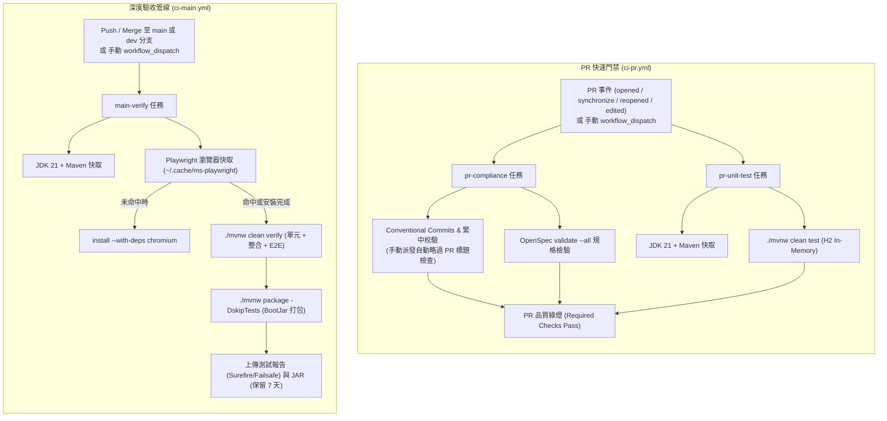

# 日常流水帳系統 — GitHub Actions CI 與分支保護治理指南

> **系統名稱**：日常流水帳系統 (Daily Ledger System)  
> **技術規範**：GitHub Actions CI/CD 自動化與分支品質門禁  
> **適用分支**：`main`、`dev` 及所有以 `main` 或 `dev` 為目標之 Pull Requests  
> **維護狀態**：正式啟用 (Active & Governed)  

---

## 1. 導言與設計理念 (Introduction & Philosophy)

為確保專案在多人協作與 AI 代理人開發過程中，具備高效率、零退化與高一致性的代碼品質，專案建立了**雙層分流持續整合架構 (Two-Tier CI Pipeline)**：

1. **第一層：PR 快速門禁 (`ci-pr.yml`)**  
   著重於**秒級反饋 (Fail-Fast)**。在針對 `main` 或 `dev` 分支提交或更新 PR，或透過 `workflow_dispatch` 手動派發時觸發。校驗 PR 標題與提交歷史（Commit Messages）之繁體中文規範、執行 OpenSpec 規格一致性檢查，並於 1 分鐘內完成 H2 記憶體模式之單元測試，排除下載瀏覽器之負擔。
2. **第二層：深度驗收管線 (`ci-main.yml`)**  
   著重於**全量驗證與交付準備 (Deep Verification)**。在代碼合併或推送至 `main`、`dev` 分支，或透過 `workflow_dispatch` 手動派發時觸發。透過快取之 Playwright 瀏覽器引擎執行全量測試（單元、整合及 Playwright E2E 真機驗收），並完成 Spring Boot 可執行 JAR 打包與報告歸檔。

---

## 2. 雙層管線架構與觸發矩陣 (Pipeline Architecture & Trigger Matrix)



### 2.1 觸發事件與分支矩陣 (Trigger Matrix)

| 工作流程 (Workflow) | 觸發事件 (Events) | 目標分支 (Branches) | 手動派發 (`workflow_dispatch`) | 核心守門重點與防禦行為 |
| :--- | :--- | :--- | :---: | :--- |
| **`ci-pr.yml`**<br>(PR Quality Gate) | `pull_request`<br>(opened, synchronize, reopened, edited) | `main`, `dev` | ✅ 支援 | PR 標題合規、繁中 Commit 格式、OpenSpec 規格檢查、H2 單元測試（手動觸發時具備事件感知，自動略過 PR 標題檢查）。 |
| **`ci-main.yml`**<br>(Deep Verification) | `push` | `main`, `dev` | ✅ 支援 | 完整 Surefire 單元測試 + Failsafe Playwright E2E 瀏覽器整合測試、Spring Boot JAR 打包、測試報告歸檔。 |

---

## 3. 提交規範與 PR 標題檢驗契約 (Commit & PR Compliance Contract)

專案嚴格遵循 **Conventional Commits** 與 **繁體中文 (Traditional Chinese)** 規範，並由 CI 於 `pr-compliance` 任務中自動阻擋非合規提交。

### 3.1 格式規範
```
<type>(<scope>): <繁體中文簡述>
```

- **Type 白名單**：
  - `feat`: 新增功能
  - `fix`: 修復缺陷
  - `refactor`: 重構（不影響外部行為的代碼結構調整）
  - `perf`: 效能優化
  - `test`: 新增或調整測試案例
  - `style`: 代碼格式微調（排版、標點，不影響業務邏輯）
  - `docs`: 文件、規格與手冊新增或更新
  - `chore`: 雜項任務、相依版本升級、IDE 配置
  - `revert`: 撤銷前次提交
- **Scope 白名單**：
  - `controller`: Web API / MVC 控制器
  - `service`: 業務邏輯與交易控制
  - `repository`: 資料庫存取
  - `entity`: 資料庫實體
  - `dto`: Request / Response 物件
  - `config`: Spring 配置與設定檔
  - `security`: 安全性、認證與授權
  - `exception`: 異常處理與錯誤碼
  - `view`: 前端頁面、Vue、CSS、靜態資源
  - `common`: 工具類與共用常數
  - `build`: Maven、依賴、Git 設定
  - `specs`: OpenSpec 規格與變更檔案
- **強制要求**：
  - 冒號與簡述之間**必須有半形空格** (`: `)。
  - 簡述內容**必須包含中文字元** (`[\u4e00-\u9fa5]`)。
  - 結尾**嚴格禁止加句號**（半形 `.` 或全形 `。` 皆不可使用）。

### 3.2 範例對照表

| 狀態 | 範例訊息 | 審查判定 |
| :--- | :--- | :--- |
| ✅ **合規** | `feat(controller): 新增每日流水帳控制器與 CRUD 介面` | 通過 |
| ✅ **合規** | `fix(security): 修復 JWT 令牌過期校驗邏輯異常` | 通過 |
| ✅ **合規** | `docs(specs): 更新 CI 管線規格書與分支保護手冊` | 通過 |
| ❌ **違規** | `feat(controller): add ledger controller` | 失敗（缺少繁體中文字元） |
| ❌ **違規** | `feat(system): 新增控制器` | 失敗（`system` 不在授權 Scope 清單中） |
| ❌ **違規** | `feat(controller): 新增控制器。` | 失敗（結尾帶全形句號 `。`） |
| ❌ **違規** | `feat(controller): 新增控制器.` | 失敗（結尾帶半形句號 `.`） |
| ❌ **違規** | `feat(controller)新增控制器` | 失敗（缺少冒號與半形空格） |

---

## 4. 本地除錯與模擬執行 SOP (Local Verification SOP)

在發起 Pull Request 前，開發者應於本地完成預檢，確保提交即通過：

### 4.1 規格合規檢驗 (OpenSpec Validation)
```bash
openspec validate --all
```
*預期產出：全專案規格書、Change Proposals 與 Tasks 檢核通過，回傳退出碼 0。*

### 4.2 本地極速單元測試 (Unit Test Gate)
```bash
./mvnw clean test --no-transfer-progress
```
*預期產出：執行所有 `*Test.java`（排除 `*IT.java` 與 `*E2ETest.java`），100% 通過且無編譯警告。*

### 4.3 本地全量驗收測試 (Full Verification & E2E)
```bash
# 確保 Playwright 瀏覽器就緒 (若首次執行)
./mvnw exec:java -e -Dexec.mainClass=com.microsoft.playwright.CLI -Dexec.classpathScope=test -Dexec.args="install chromium"

# 執行全量驗證 (涵蓋 Surefire 單元測試 + Failsafe E2E 測試)
./mvnw clean verify --no-transfer-progress
```
*預期產出：Surefire 與 Failsafe 報告全數 PASS，於 `target/failsafe-reports/` 產出測試結果。*

### 4.4 手動派發操作指引 (Manual Workflow Dispatch)

若需在無 Pull Request 或未推送代碼的情況下對管線進行排查驗收，可透過 GitHub 介面或 CLI 手動派發：

#### 網頁介面操作 (GitHub Web UI)
1. 進入倉庫頁面，點擊上方導覽列的 **Actions** 標籤。
2. 於左側清單選擇目標工作流程（如 `CI - PR Quality Gate` 或 `CI - Main Deep Verification`）。
3. 點擊右側的 **Run workflow** 下拉按鈕。
4. 選擇欲運行的分支（如 `dev` 或 `main`），點擊綠色 **Run workflow** 按鈕啟動。

#### 命令行工具操作 (GitHub CLI)
```bash
# 手動觸發 PR 快速門禁（針對 dev 分支）
gh workflow run ci-pr.yml --ref dev

# 手動觸發深度驗收管線（針對 main 分支）
gh workflow run ci-main.yml --ref main
```

> [!NOTE]
> **手動派發防禦性機制**：手動派發 `ci-pr.yml` 時，工作流程會感知 `github.event_name == 'workflow_dispatch'`，自動略過 PR 標題存在性與格式檢驗，安全執行 OpenSpec 規格校驗、Commit 歷史校驗與單元測試。

---

## 5. GitHub 分支保護規則配置指南 (Branch Protection Rules)

為落實 CI 門禁強制力，倉庫管理員應於 GitHub 專案設定針對 `main` 與 `dev` 分支進行以下配置：

1. 導航至 GitHub 倉庫：**Settings** -> **Branches** -> 點擊 **Add branch protection rule**。
2. **Branch name pattern**：輸入 `main`（建議對 `dev` 亦建立相同規則）。
3. 勾選 **Protect matching branches** 關鍵選項：
   - [x] **Require a pull request before merging**
     - [x] Require approvals: 至少 1 位審查者（依專案團隊規模設定）
     - [x] Dismiss stale pull request approvals when new commits are pushed
   - [x] **Require status checks to pass before merging**
     - [x] Require branches to be up to date before merging
     - 於搜尋框中新增以下必要檢查點 (Status Checks)：
       - `PR Compliance & Specs Validation` (對應 `pr-compliance` 任務)
       - `Fast Unit Test Gate` (對應 `pr-unit-test` 任務)
   - [x] **Do not allow bypassing the above settings** (禁止管理員繞過檢查)
4. 點擊 **Save changes** 完成配置。

---

## 6. 維運與產出物生命週期 (Artifacts Retention)

- **Surefire / Failsafe 測試報告**：每次 `main` 或 `dev` 分支推播後自動保存於 GitHub Actions Artifacts (`surefire-and-failsafe-reports`)，保留期限為 **7 天**。
- **可執行 JAR 產物**：在全量驗證成功後打包產出之 `target/*.jar` 保存於 GitHub Actions Artifacts (`application-jar`)，保留期限為 **7 天**。
