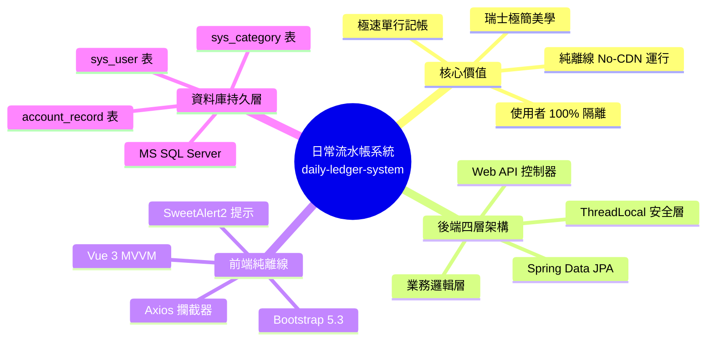

# 1. 提案與執行摘要 (Executive Summary & Proposal)

> **專案代號**：`daily-ledger-system`  
> **所屬模組**：提案總覽與核心價值  
> **相關基準**：[OpenSpec Specs](../../../openspec/specs)

---

## 1. 執行摘要 (Executive Summary)

本系統旨在解決個人記帳操作繁瑣、介面壅塞與過度依賴外網 CDN 的問題。透過打造**類 Google 搜尋框之中央極速記帳工作台**、落實**使用者資料 100% 獨立隔離**與**無狀態 JWT 認證**，並結合**純離線 (Strict No-CDN) 瑞士國際主義風格 (Swiss Design Style)** 視覺系統，建構一套極簡、俐落、高效且可擴展的記帳微服務。

---

## 2. 提案總覽 (Proposal: Why & What Changes)

### 2.1 為什麼需要此變更 (Why)

現行記帳軟體常受限於繁瑣的多層跳轉表單，或重度依賴第三方雲端與外部 CDN，造成網路受限環境下無法穩定運行。

本專案以 **Spring Boot 3.x** 為骨幹，提供嚴格的四層架構與 **MS SQL Server** 資料持久化，前端採用純離線自託管架構，結合瑞士紅 (`#DC2626`) 與網格幾何排版，實現極致俐落的高效記帳體驗。

### 2.2 變更範圍與四大能力 (Capabilities)

| 能力代號 (Capability) | 類型 | 涵蓋範疇與交付目標 |
| :--- | :--- | :--- |
| **`user-authentication`** | 新增 (New) | 使用者註冊、BCrypt 密碼雜湊、JWT Token 簽發/校驗、ThreadLocal 使用者上下文隔離。 |
| **`category-management`** | 新增 (New) | 雙層分類體系（系統內建預設共用 + 使用者自訂專屬分類）之查詢、新增、修改與關聯防呆刪除。 |
| **`daily-ledger`** | 新增 (New) | 流水帳 CRUD、多維度組合搜尋（關鍵字/日期/收支/分類）、分頁查詢與本月即時收支結餘彙總計算。 |
| **`offline-web-ui`** | 新增 (New) | 純離線靜態資產架構、瑞士風格主題樣式、中央搜尋框記帳工作台、即時統計卡片與自訂分類視窗。 |
