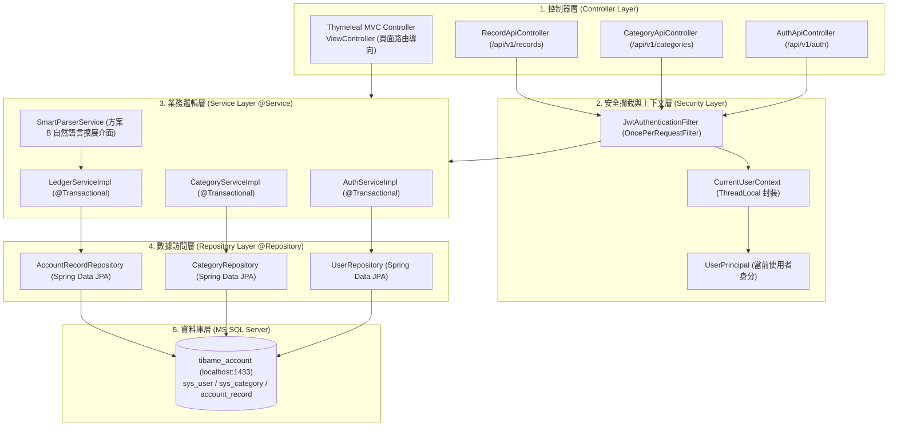
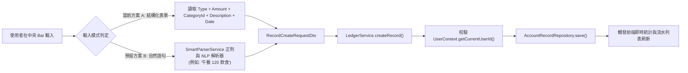
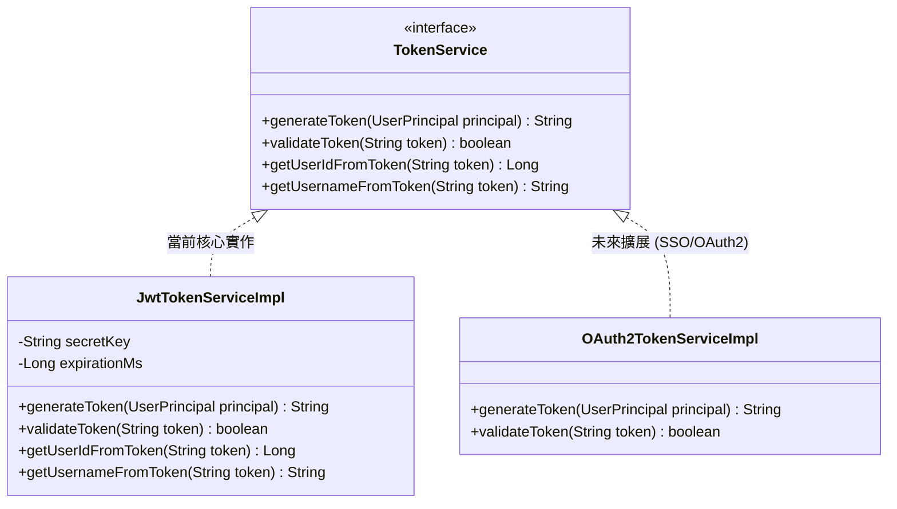

# 3. 系統技術架構與設計 (Architecture & Technical Design)

> **專案代號**：`daily-ledger-system`  
> **所屬模組**：系統分層架構與類別設計  
> **相關基準**：[OpenSpec Specs](../../../openspec/specs)

---

## 1. 系統總體四層分層架構

系統嚴格遵循 Spring Boot 四層架構原則，層與層之間職責分離、依賴單向：

---

## 2. 輸入擴展架構：方案 A (結構化) 與 方案 B (自然語言)

---

## 3. 可插拔 Token 服務類別設計

系統定義 `TokenService` 介面，預設由 `JwtTokenServiceImpl` 實現無狀態 JWT 簽發與校驗；未來可無縫切換為 OAuth2 / SSO 實作。

