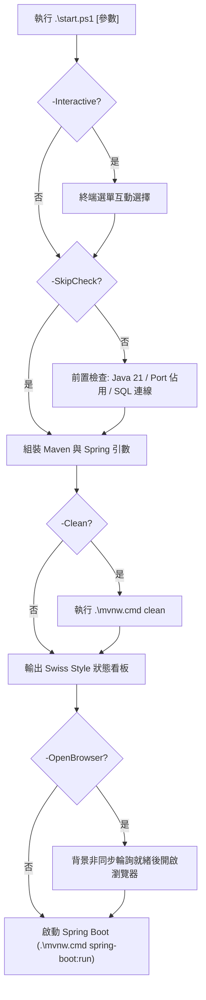

# 07. PowerShell 啟動腳本與維運指南 (Startup Script & DevOps Guide)

本文件為「日常流水帳系統 (`daily-ledger-system`)」本機一鍵啟動腳本 `start.ps1` 的技術規格與操作指南。

---

## 1. 執行目標與設計哲學

- **零配置開箱即用**：預設以 H2 記憶體資料庫啟動，無須依賴外在環境即可測試完整功能。
- **雙資料庫支援**：提供 `-Profile mssql` 旗標直接無縫銜接本機 MS SQL Server。
- **智慧前置診斷**：自動探測 Java 21+、Port 8080 衝突診斷（提示佔用 PID）、SQL Server 1433 連線狀態。
- **自動化體驗**：支援就緒自動開啟瀏覽器、遠端除錯（Port 5005）、互動式選單及任意參數透傳。

---

## 2. 執行架構圖



---

## 3. 完整參數速查

| 參數 | 別名 | 預設值 | 說明 |
| :--- | :--- | :--- | :--- |
| `-Profile` | `-p`, `-Mode` | `'h2'` | 運作環境 (`h2` / `mssql` / `prod`) |
| `-Port` | `-serverPort`, `-httpPort` | `8080` | 指定 HTTP Port |
| `-Clean` | `-c` | `$false` | 啟動前先執行 `mvn clean` |
| `-DebugMode` | `-d` | `$false` | 開啟 JVM Remote Debugger (Port 5005) |
| `-OpenBrowser` | `-b` | `$false` | 服務啟動後自動在預設瀏覽器開啟網頁 |
| `-Interactive` | `-i` | `$false` | 進入互動式數字選單 |
| `-SkipCheck` |  | `$false` | 略過所有前置環境檢查 |
| `$ExtraArgs` |  | `$null` | 透傳參數至 Maven / Spring Boot |

---

## 4. 常用範例

```powershell
# 1. 預設啟動 (H2 模式, 8080)
.\start.ps1

# 2. MS SQL 模式
.\start.ps1 -p mssql

# 3. 指定 Port 並自動開啟瀏覽器
.\start.ps1 -Port 9090 -b

# 4. 互動式選單模式
.\start.ps1 -i
```

---

## 5. 正式伺服器環境變數注入 SOP (Production DevOps SOP)

在正式生產環境中，系統全面實施**原始碼零機密 (Zero Secrets in VCS)** 與 **弱密碼啟動攔截 (Fail-Fast on Missing Secrets)** 原則。正式伺服器禁止於 `application*.yml` 內明文撰寫真實帳密與簽署金鑰，必須由底層基礎設施注入以下核心環境變數：

### 核心敏感變數清單

| 環境變數名稱 | 適用 Profile | 必填性 | 規範與安全要求 |
| :--- | :--- | :--- | :--- |
| `DB_URL` | `prod`, `mssql` | 選填 (建議注入) | 正式資料庫 JDBC 連線字串 (包含加密與憑證設定) |
| `DB_USERNAME` | `prod`, `mssql` | 選填 (預設 `sa`) | 資料庫專用連線帳號 (遵循最小權限原則) |
| `DB_PASSWORD` | `prod`, `mssql` | **必填** (正式環境) | 高強度資料庫密碼 |
| `JWT_SECRET` | `prod` (全環境) | **強制必填** (`prod`) | HMAC-SHA256 簽署金鑰，**嚴禁使用開發預設值**，長度至少 32 位元組 (256 位元) |
| `JWT_EXPIRATION_MS` | 全環境 | 選填 (預設 86400000) | JWT 權杖有效毫秒數 (如 86400000 = 24 小時) |

> [!CAUTION]
> **啟動期防呆攔截 (Fail-Fast Defense)**：若啟用 `--spring.profiles.active=prod` 但未覆蓋 `JWT_SECRET`（或長度小於 32 位元組），Spring Boot 將在啟動期立即拋出 `IllegalStateException` / `IllegalArgumentException` 並終止行程，防止裸奔上線。

### 部署途徑與注入標準

#### 途徑 A：Linux Systemd Service (`chmod 600` 環境檔)
1. 建立獨立機密環境變數檔 `/etc/tibame/daily-ledger.env`：
   ```bash
   DB_URL=jdbc:sqlserver://db.internal.corp:1433;databaseName=tibame_account;encrypt=true;trustServerCertificate=false;
   DB_USERNAME=ledger_app_user
   DB_PASSWORD=VeryStrongProdPassword_2026!#
   JWT_SECRET=ProductionSuperSecretKeyWithHighEntropy2026_Min256BitsLengthRequired!#
   JWT_EXPIRATION_MS=86400000
   ```
2. 嚴格設定檔案權限（僅允許服務運行者存取）：
   ```bash
   sudo chown root:tibame /etc/tibame/daily-ledger.env
   sudo chmod 600 /etc/tibame/daily-ledger.env
   ```
3. 於 Systemd Unit 檔 (`/etc/systemd/system/daily-ledger.service`) 中引用：
   ```ini
   [Unit]
   Description=Daily Ledger System Service
   After=network.target

   [Service]
   User=tibame
   Group=tibame
   EnvironmentFile=/etc/tibame/daily-ledger.env
   ExecStart=/usr/bin/java -jar /opt/tibame/daily-ledger-system.jar --spring.profiles.active=prod
   SuccessExitStatus=143
   Restart=always
   RestartSec=10

   [Install]
   WantedBy=multi-user.target
   ```

#### 途徑 B：Docker Compose
在 `docker-compose.yml` 同級目錄建立 `.env.prod`（確保納入 `.gitignore`），並在服務中載入：
```yaml
version: '3.8'
services:
  app:
    image: daily-ledger-system:latest
    ports:
      - "8080:8080"
    env_file:
      - .env.prod
    environment:
      - SPRING_PROFILES_ACTIVE=prod
    restart: unless-stopped
```

#### 途徑 C：Kubernetes Secrets
1. 建立 K8s 敏感機密物件：
   ```bash
   kubectl create secret generic daily-ledger-secrets \
     --from-literal=DB_URL='jdbc:sqlserver://mssql-service:1433;databaseName=tibame_account;encrypt=true;' \
     --from-literal=DB_USERNAME='ledger_app' \
     --from-literal=DB_PASSWORD='StrongPassword2026!' \
     --from-literal=JWT_SECRET='K8sProdHighEntropyJwtSecretKeyWithMoreThan32BytesLength2026!#' \
     -n production
   ```
2. 於 Deployment 中掛載至環境變數：
   ```yaml
   apiVersion: apps/v1
   kind: Deployment
   metadata:
     name: daily-ledger-app
     namespace: production
   spec:
     template:
       spec:
         containers:
           - name: daily-ledger
             image: daily-ledger-system:latest
             envFrom:
               - secretRef:
                   name: daily-ledger-secrets
             env:
               - name: SPRING_PROFILES_ACTIVE
                 value: "prod"
   ```

