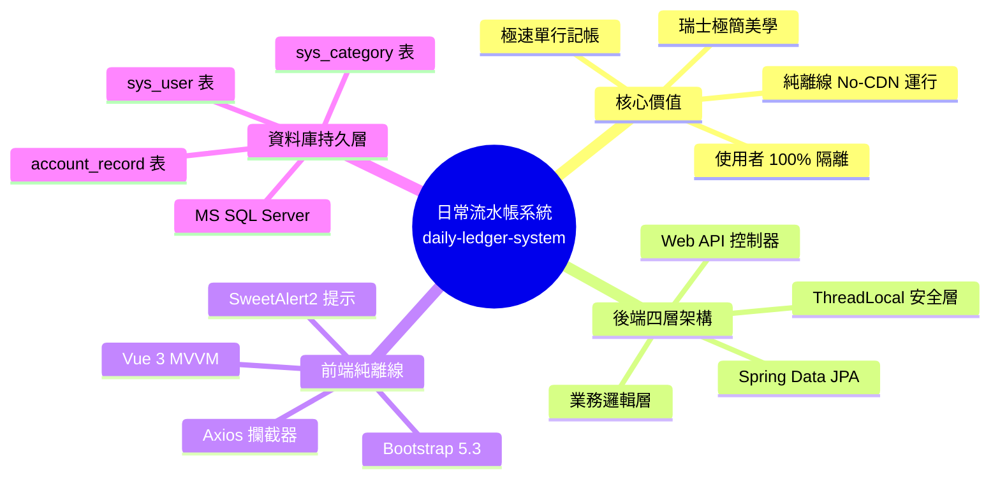

# 日常流水帳系統 (Daily Ledger System) — 文件導覽目錄 (Documentation Index)

> **專案代號**：`daily-ledger-system`  
> **基準變更**：`openspec/changes/daily-ledger-system`  
> **技術棧**：Spring Boot 3.x ➔ Spring Data JPA ➔ MS SQL Server ➔ Thymeleaf ➔ Vue 3 MVVM (No-CDN Offline) ➔ Swiss Style Design  
> **導覽指引**：[← 返回專案文件總覽門戶 (docs/README.md)](../../README.md)  
> **報告日期**：2026-09-01  
> **狀態**：規劃產物完整審查通過 (`Planning Complete`, `Strict Validated`)

---

## 系統文件清單

本資料夾為「日常流水帳系統 (`daily-ledger-system`)」之分類規格與規劃技術文件庫，已依據業務與技術領域拆分為以下獨立文件：

| 檔案名稱 | 種類 / 模組 | 主要內容摘要 |
| :--- | :--- | :--- |
| [01_executive_summary_and_proposal.md](01_executive_summary_and_proposal.md) | **提案與執行摘要** | 專案背景、核心價值心智圖、為什麼需要此變更 (Why)、四大核心能力範疇。 |
| [02_functional_specifications.md](02_functional_specifications.md) | **功能規格契約** | 使用者認證、分類管理、流水帳記帳與離線前端等四大規格情境與時序流程圖。 |
| [03_system_architecture_and_design.md](03_system_architecture_and_design.md) | **技術架構與設計** | 後端四層分層架構、雙輸入模式（方案 A/B）擴展架構、可插拔 TokenService 類別設計。 |
| [04_database_design_and_ddl.md](04_database_design_and_ddl.md) | **資料庫設計與 DDL** | MS SQL Server 資料庫 ERD 關聯圖、資料表欄位定義與初始化 Seed 腳本。 |
| [05_tasks_and_implementation_plan.md](05_tasks_and_implementation_plan.md) | **任務分解與實施計畫** | 實作甘特圖 (Gantt Chart)、7 大模組共 16 項可驗收實作任務清單明細。 |
| [06_quality_assurance_and_dod.md](06_quality_assurance_and_dod.md) | **品質保證與驗收標準** | 交付定義檢核矩陣 (DoD Matrix)、安全/效能/離線規範與總結。 |
| [07_startup_script_and_devops_guide.md](07_startup_script_and_devops_guide.md) | **啟動腳本與維運指南** | PowerShell `start.ps1` 參數規格、智慧前置診斷、雙資料庫切換與維運指南。 |
| [08_system_operation_and_user_manual.md](08_system_operation_and_user_manual.md) | **系統操作手冊與案例指南** | 終端使用者 SOP、中央記帳操作、收支儀表板、自訂分類防呆與實務生活案例演練。 |
| [09_unit_testing_guide_and_test_catalog.md](09_unit_testing_guide_and_test_catalog.md) | **單元測試操作手冊與盤點清單** | 單元測試執行指南、AAA 撰寫範式、全套件 54 個單元測試案例盤點與開發檢核清單。 |
| [10_e2e_testing_guide_and_operation_manual.md](10_e2e_testing_guide_and_operation_manual.md) | **端到端測試操作手冊與維運指南** | E2E 測試分流指南、四大分頁工作台 POM 適配、動態有頭除錯模式 (SlowMo)、13 大全鏈路案例矩陣與 FAQ 排查對策。 |

---

## 系統總體心智圖

